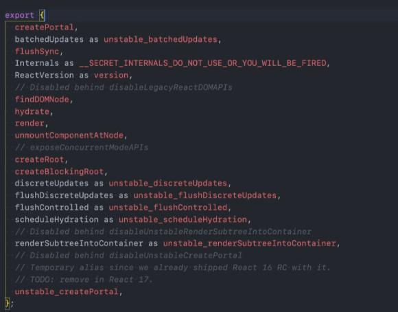
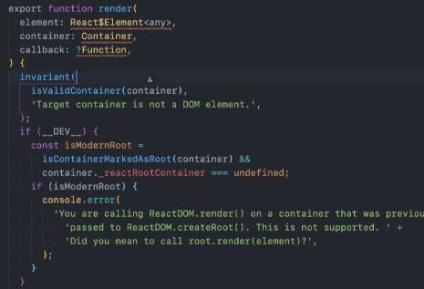

## 一、React是什么？

1. 官方定义：React是一个用于构建用户界面的javaScript库
对于前端开发人员来说，其工作内容就是构建用户界面，而构建用户界面离不开三个技术：
HTML：构建页面的结构
CSS：构建页面的样式
JavaScript：构建页面动态内容和页面交互

2. 原生js开发页面到渐进式框架开发页面的过程

最早是用原生JS开发页面，但是原生js开发存在以下几个问题：
+ DOM兼容性问题,由于需要频繁操作DOM，所以DOM兼容性问题很容易暴露
+ 代码冗余问题
+ 代码组织和规范问题

之后通过jQuery库进行开发，jQuery成为了最流行和使用最多的JavaScript库，虽然简化了DOM操作但是核心还是操作DOM

现在用类似Vue和React这样的框架，之所以框架开发页面应用的目的只有一个：那就是用框架可以帮助我们前端开发人员更加高效和快速的构建用户页面，国内流行的三个前端框架都是构建用户页面的。

## 二、React的起源

React是2013年Facebook开源的JavaScript库，之所以出现这个库，是源于一个bug。这个bug就是当数据变化的时候过多的操作DOM就会很容易产生bug

问题1：传统的开发模式中，我们过去都是过多的操作了界面的细节，比如需要掌握和使用大量操作DOM的api，虽然可以通过jQuery来简化。

问题2：关于数据也就是状态，会分散到各个地方，不方便管理和维护，页面状态不方便维护

FB团队通过React的解决方案：
1. 以组件的方式划分一个个功能模块
2. 组件内以jsx的方式来描述UI的样子
3. 组件内以state的方式来存储组件内的状态
4. 当应用的状态发生变化的时候，通过setState修改状态，状态发生变化的时候，UI界面随之自动发生更新

## 三、React的三大特点
1. 声明式编程
声明式编程和命令式编程的区别
声明式编程式目前整个大前端开发的模式，Vue，React、Flutter和SwiftUI都是声明式编程的开发模式
声明式编程只允许我们维护自己的状态，当状态发生变化的时候，React可以根据最新的状态去渲染我们的UI界面

UI = f(state) 状态state通过f也就是rander函数渲染之后变为我们可见的UI界面
+ UI 代表用户界面
+ f 代表render函数
+ state 代表组件状态(数据)
我们只需要某种方式去修改state，render函数就会重新编译，UI页面就会更新，整个过程中不需要进行DOM操作

2. 组件化开发
组件化开发是前端开发的流行趋势，将复杂的界面拆分成为一个个小的组件
合理的进行组件的划分和设计也是一个重点

3. 多平台适配
2013年 React.js布之处可以开发Web页面
2015年 React Native可以开发移动端跨平台应用(比不上flutter和uni-app)
2017年 React VR可以开发虚拟现实Web应用程序

## 四、学习React的三个必要性————高级前端必备技能

1. 学习React的过程就是掌握最先进的思想和技术的过程
React由Facebook进行维护，它是大量优秀程序员的结晶
当前世界上流行的其他框架都借鉴了React的编程思想，Vue.js框架的设计很多灵感都来自与Angular和React。

举例1： 比如React Hooks这个开创性的新功能，最新版本的Vue3.0中的Vue Function Based API就是借鉴了React Hooks的思想

举例2： Flutter的官网上的一句话说明了它的设计灵感来自于React框架，比如Flutter中的Widget - Element - RenderObject，对应的就是React中的JSX - 虚拟DOM - 真实DOM 

2. 一个优秀的前端开发人员必须学会React和Vue这两大框架
HackerRank中统计最想学习的framework框架，排名第一的是React
国内外很多大厂都使用React进行开发，要想进入大厂，React必须要精通。
React是前端高级工程师的必备技能

3. React是前端的先驱者，它总是会引领前端的潮流。

## 五、在HTML页面中使用Raect开发的一些要点
1. 使用react.js的两种方式
+ 在HTML页面中嵌入React.js的依赖(轻巧 简单 CDN 采用一步步从HTML走向脚手架搭建方便理解) 
+ 用React的脚手架进行开发(笨重 复杂)

2. 在HTML页面中使用react.js所必须要依赖的三个库
+ react：包含react所必须的核心代码

+ react-dom：react-dom可以根据不同的平台去渲染不同平台对应的组件
如果开发web端，react-dom会见jsx最终渲染为真实的DOM，最终显示在浏览器中
如果开发native端，react-dom会将jsx渲染为移动端原生的控件，比如Android的Button，IOS中的UIButton

+ babel：最主要的作用是将jsx转化为React代码的工具
又名babel.js，是目前前端使用最多的代码转化器，因为很多我们平时开发中写在项目中的ES6+代码，浏览器本身是并不支持的，但是ES6+语法又非常的简洁，为了解决这个问题，我们一般在写源码的时候通过ES6进行编写，之后通过babel工具，将ES6代码转化为大多数浏览器都可以识别的ES5的语法。

3. 为什么要三个库？Vue不是只需要引入一个vue.js就可以了么？
三个库各司其职，其实是从底层进行了解耦，Vue之所以引入一个只不过是把三个融合到了一个里面
而且一开始三个库并没有拆分，而是后来出现了React-native之后，才将一个react.js拆分为现在的react以及react-dom两个库。

4. 在三个库引入的前提下，在HTML页面中开发react.js的两种方式
两种方法它们底层的原理是一样的，但是很明显后者要比前者简单很多！

+ 不用babel工具，用React.renderElement()
直接用React.renderElement()这种方法开发界面，比如在页面上渲染一个h2标签，这种方式太复杂，这种api开发的方式虽然复杂，好处在于React.renderElement()这种代码是可以直接被浏览器所识别并执行的，并且是可以被react库中相关代码所使用并最终生成虚拟DOM的。

+ 充分利用babel工具 使用JSX(JavaScript XML)
用类似与HTML的方式开发界面，然后通过babel转化为React.renderElement()来创建页面
在HTML中使用jSX语法开发的时候，必须要在script标签声明type=“text/babel”才可以将浏览器无法识别的jsx代码编译为可以执行的代码。
JSX其实是一个语法糖，只要写了JSX这个语法糖，那么就会基于babel将jsx代码转化成为React.renderElement()相关代码

5. 在HTML页面中引入以上三个依赖的方法
+ 直接通过CDN引入
```js
<script src="https://unpkg.com/react@16/umd/react.development.js" crossorigin></script>
<script src="https://unpkg.com/react-dom@16/umd/react-dom.development.js" crossorigin></script>
<script src="https://unpkg.com/babel-standalone@6/babel.min.js"></script>
```
+ 下载到本地，通过本地依赖引入
+ 通过npm包管理工具


## 五、基于原生js和React实现一个hello world
需求：在界面显示一个hello world，点击按钮，文本变为Hello React
```html
<div id="app"></div>
```

### 原生JS实现————命令式编程
编程范式：命令式编程，每做一个操作都是给浏览器一步步的命令，浏览器按照我们一步步的命令去执行
1. 定义数据
2. 将数据插入到DOM中
3. 绑定点击事件，事件触发，界面数据发生改变
```js
const value = 'hello react !!!';
const btn = document.getElementByTagNames('button')[0];
btn.addEventListener('click',()=>{
	btn.innerHTML = value;
})
```

### React实现————声明式编程
编程范式：声明式编程。通过操作数据层或者DOM层去修改数据，UI界面响应数据变化而变化

#### 方案一：代码复杂，但是可以理解原理
```js
<script type="text/babel">
	let message = 'hello world';
	function btnClick(){
		console.log(message);
		message = 'Hello React';
		// 当事件触发的时候，再次调用renderNow方法，将数据的更新反馈到视图上
		renderNow();
	}
	
	<!-- 将ReactDOM.render函数封装在renderNow函数中，方便多次调用 -->
	function renderNow(){
		ReactDOM.render((
			<div>
				<h2>{message}</h2>
				<button onClick={btnClick}>改变文字</button>
			</div>
		),document.getElementById("app"));
	}
	
	<!-- 页面加载后第一次调用renderNow,此时渲染页面DOM结构 -->
	renderNow();
	
</script>
```

1. DOM结构基于ReactDOM.render()这个内置API进行创建
该方法接收三个参数
第一个参数：Element 也就是需要渲染的内容
	这个内容可以是一个或多个HTML标签组成的DOM结构，或者是一个已经封装好的组件如<App/>
	当存在比较复杂的结构的时候，一般用一个小括号括起来，代表一块整体
	在这里使用JSX语法的时候，是通过{}语法来写入变量和函数名的
	jsx特点：多个标签最外层必须有且只能有一个根标签，不能在第一个参数中传入两个兄弟标签
	渲染的内容可以写JSX语法代码，这里的JSX最后会被转化为react-render-object这样一个对象
	
第二个参数：Container 也就是要挂载的DOM元素对象 
	可以理解为将渲染的内容放的一个容器
	不管之前这个DOM元素中有多少内容，在此API调用之后，都会将之前的内容全部覆盖

第三个参数：Callback 回调函数

2. 响应事件后更新数据和视图通过手动封装renderNow方法手动调用实现

原理：当数据发生改变的时候，要想让界面发生改变，必须重新渲染jsx（DOM），这时候原先写在jsx语法中的变量才可以拿到最新的数据，然后页面才可以渲染最新的数据，这一点和Vue是不一样的

核心：核心就是驱动render函数多次执行，在这里只能封装起来多次调用。

3. 这里的ReactDOM和render函数从哪里来?为什么一调用就可以渲染DOM？

>>> ReactDOM对象来源：

下载react源码文件
找到react-dom文件夹下的index.js文件
index.js中向外部暴露了来自于src/client/ReactDOM导出的对象,所有引入了react三个依赖的页面都可以直接使用
` export * from './src/client/ReactDOM' `

src/client/ReactDOM.js文件中暴露出了一个对象，这个对象转化成为ES5语法的时候，这个对象就叫做ReactDOM，它上面有一个render函数


>>> render函数来源：
render函数写在ReactDOMLegery.js文件中，它是上面导出的ReactDOM对象上的一个方法，所以外部可以直接通过ReactDOM.render()函数来进行渲染DOM。


#### 方案二：组件化开发 深入理解React组件化开发的原理和流程
>>> 第一步：先通过继承自React.Component类创建一个组件
1. React.Component类来自于react文件夹下index.js中export导出一个大对象中有一个类Component
2. React中创建组件有很多方法，最常用的就是基于ES6的类的继承来创建一个新组件的
   > constructor：构造器
   + constructor中必须要执行一下super()方法，等于是初始化了一个React.Component类的实例
   + 应该将所有状态(属性)放在constructor中，通过this.state = {}进行保存，这个state名称不可修改
   + 继承得到的这个类中的this指向当前这个类所构造出来的对象实例
   
   > render：渲染dom
   + 组件要渲染什么内容，就要写在render函数中，并通过一个return 返回值的形式返回
   
   > 自定义方法：实现功能
   + 所有自定义方法内部的this默认都是undefined，因为ES6的class默认开启严格模式，严格模式下没有指定this指向的函数内部this都是undefiend，也就是调用btnCLick方法执行，本质是执行了btnClick.apply(undefined,...args)。
   + 如果要在自定义方法内部的this指向当前类构造出来的实例对象，那么需要在绑定事件处理函数的时候就用bind强行绑定一个this，this为继承的App这个类生成的实例对象，这样子就可以在内部调用的时候this不会变为undefiend
	
   > 数据响应
   通过setState({key:value})的方法来修改数据，再React中永远不要去手动调用render方法修改数据
   1. 参数为object，里面是要更新的属性和新的属性值
   2. 调用setState函数，内部会进行更新操作
   3. 更新操作第一步就是内部重新调用当前类的render函数，根据设置的最新数据返回最新的JSX代码
   4. JSX对应的React.createELment改变相对应的DOM节点
   5. 界面更新最新的数据展示

   
>>> 第二步：再通过ReactDOM.render()渲染创建好的组件

```js
<!-- 创建组件 -->
class App extends React.Component {
	constructor(){
		super();
		this.state={
			message = 'hello world';
		}
	}
	
	render(){
		return (
			<div>
				<h2>{this.state.message}</h2>
				<button onClick={this.btnClick.bind(this)}>改变文字</button>
			</div>
		)
	}
	
	btnClick(){
		console.log(this); 
		this.setState({message:'Hello React'})
	}
}

<!-- 渲染组件 -->
ReactDOM.render(</App>,document.getElementById('app'));

```


------------------------------------------------------------------------------

周六学习计划
jsx核心语法一
jsx核心语法二
jsx的本质-源码-阶段案例

周日学习计划
React脚手架的详细解析
React组件化开发一
React组件化开发二

挤出时间看 setState详细解析和React性能优化

周一学习计划
知识补充和受控非受控组件
高阶组件和组件补充
组件化补充和React中样式

AntDesign库的使用以及其他补充

React中axios使用和封装
React过渡动画和纯函数使用

React Hooks一
React Hooks二

上班时间看官网文档 并进行代码实际操练

------------------------------------------------------------------------------