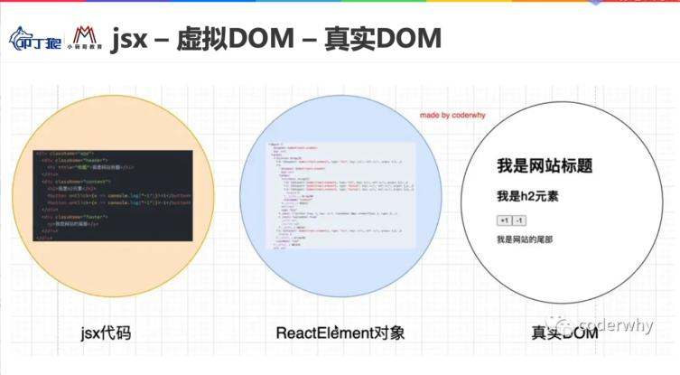

## 1. JSX语法在React中的本质
> jsx本质就是下面这个函数React.createElement的语法糖，所有的jsx语法都会最终经过babel.js转化成为React.createElement这个函数的函数调用

> React.createElement(component,props,...children)函数

1. jsx写法：必须引入babel并且设置script标签的type为text/bable
babel:将jsx转化为React.createElement()这种函数的调用
```js
<script type="text/babel">
	const message1 = <h2>这是采用babel编译的jsx语法糖写法</h2>
	ReactDOM.render(message1,document.getElementById('app'));
</script>
```

2. React.createElement写法
不使用jsx这种语法糖写法，就想用React.createElement()这种方式写，那么其实babel.js这个库不需要引入，script标签的type也不用写成text/babel了
```js
<script type="text/javascript">
	const message2 = React.createElement('h2',null,'这是采用React.createElement()函数写法')
	ReactDOM.render(message2,document.getElementById('app'));
</script>

```


## 2. React.createElement()这个函数在源码的什么位置?
不要恐惧看源码
react@16.13.1版本
### 源码查找路径
源码---packages---react---index.js入口文件中---export大对象---./src/React.js---createElement--ReactElement文件内--查看大纲--找到源码

+ 在index.js中通过ES6的模块化方法export导出了一个大的对象，这个大的对象其实就是我们在项目中引用的React对象，它里面有很多方法，比如之前的Component以及当前的createElement方法

+ index.js中导出给外部的对象来自于./src/React.js文件中，这个文件才是真正导出createElement方法的文件

### createElement方法源码说明
```js React.js中
import {
  createElement as createElementProd,
} from './ReactElement';

import {
  createElementWithValidation,
} from './ReactElementValidator';

const createElement = __DEV__ ? createElementWithValidation : createElementProd;

export {
	createElement,
}
```
1. 代码规范
原则上一个文件夹看做一个模块的话，一个模块只向外暴露一个文件，这个文件就是index.js

2. 开发环境和线上环境导出的createElement方法不同
如果是开发环境，就使用带有许多验证条件的createElementWithValidation方法，有助于开发者快速定位错误
如果是线上环境，就使用线上开发版本的createElementProd方法

> 注意点：给导入模块起别名的方法
```
import {createElement as createElementProd} from './ReactElement';
```
代表从./ReactElement中导入一个方法，原本方法叫做createElement，我在导入的时候起一个别名，这个别名叫做createElementProd。Prod代表Production，是生产环境的意思。

> 查看源码技巧：注意用大纲来查找createElement而不是用全局搜索
+ 打开./ReactElement.js文件
+ 选择查看大纲，找到createElement方法
+ 查看createElement方法的源码
export function createElement(type, config, children) {...源码}


## 3. createElement方法的三个参数

```js 源码视图
export function createElement(type, config, children) {
	...
	return ReactElement(
	  type,
	  key,
	  ref,
	  self,
	  source,
	  ReactCurrentOwner.current,
	  props,
	);
}

```
参数1：type
type表示当前element的类型
如果是HTML标签，直接写字符串类型的标签名即可，如'div','span','a'等
如果是组件元素，直接写组件名称即可,如App,Loading

参数2：config
config以对象键值对的形式表示当前element的属性，如css属性，元素内置属性等等

参数3：children
children表示存储在元素中的内容，以children数组的方式进行存储
如果是多个元素，React中源码处理下面会说

## 4. babel官网对jsx语法进行转化[只是做一个验证]
一行一行手写React.createElement()验证太累，我们可以借用babel官网上的转化实现
自己尝试过才知道，jsx的写法要比React.createElement()这种方法简洁方便很多
开发的时候虽然不用这种方法写 但是要知道其背后的原理
```js 使用JSX语法糖写法
<div className="App">
  <div className="header">
      <p>啊哈哈哈</p>
  </div>
  <div className="content">
      <p>6666</p>
      <a href="https://www.baidu.com"></a>
  </div>
  <div className="footer">
      <p>9898998</p>
  </div>
</div>
```

> 利用babel官网的jsx转化器将jsx语法转化为React.createElement()函数调用写法
```js 使用React.createElement()函数调用写法
"use strict";

/*#__PURE__*/
React.createElement("div", {className: "App"}, /*#__PURE__*/React.createElement("div", {
  className: "header"
}, /*#__PURE__*/React.createElement("p", null, "\u554A\u54C8\u54C8\u54C8")), /*#__PURE__*/React.createElement("div", {
  className: "content"
}, /*#__PURE__*/React.createElement("p", null, "6666"), /*#__PURE__*/React.createElement("a", {
  href: "https://www.baidu.com"
})), /*#__PURE__*/React.createElement("div", {
  className: "footer"
}, /*#__PURE__*/React.createElement("p", null, "9898998")));

```

/*#__PURE__*/的意思代表React.createElement()这个函数是一个纯函数，PURE是纯的意思。

> createElement这个方法只有三个形参，为什么传入了多个参数还是可以正常渲染？React内部是如何处理的？

接收参数的形参只有3个function createElement(type, config, children) 
调用函数时传入实参5个React.createElement('div',null,'header','content','footer')

React源码中截取的处理方法如下：
+ 将多余的参数先做了一次判断
	如果参数只有一个，那么直接赋值即可
	如果参数大于一个，那么先创建一个当前参数数量的新数组，并且将arguments实参列表中的参数依次添加到这个新数组中
+ 然后将其添加到children属性上，此时的children实际应该是一个数组[A,B,C]
```js 来自react.js源码
const childrenLength = arguments.length - 2;
  if (childrenLength === 1) {
    props.children = children;
  } else if (childrenLength > 1) {
    const childArray = Array(childrenLength);
    for (let i = 0; i < childrenLength; i++) {
      childArray[i] = arguments[i + 2];
    }
    if (__DEV__) {
      if (Object.freeze) {
        Object.freeze(childArray);
      }
    }
    props.children = childArray;
  }
```


## 5. React中虚拟DOM的创建过程
### 1. React.createElement()方法的返回值是ReactElement()函数的执行结果

下图可知：React.createElement()方法执行的返回值是另外一个函数ReactElement()函数的执行结果
在ReactElement执行的时候，还传递了很多参数。
```js 源码视图
export function createElement(type, config, children) {
	...
	return ReactElement(
	  type,
	  key,
	  ref,
	  self,
	  source,
	  ReactCurrentOwner.current,
	  props,
	);
}

```
### 2.那么ReactElement()方法来自于哪里呢？
其实就来自于createElement这个方法存在的ReactElement.js文件中，源码如下：
+ 首先定义一个对象为element，初始化一些属性值，初始化的5个属性如下：
{
	type: type,
	key: key,
	ref: ref,
	props: props,
	 _owner: owner,
}
+ 另外还通过Object.defineProperty(obj,key,props)的方法设置了两个属性：
{
	self,
	source
}
+ 此外还通过Object.defineProperty(obj,key,props)给element._store对象设置了一个validated的属性，并设置其默认值为false

+ 最后将这个element进行冻结，并且return出去

>>> 得出结论：React.createElement()这个方法创建出来的是一个element对象，这个对象我们一般称之为ReactElement对象
```js
const ReactElement = function(type, key, ref, self, source, owner, props) {
  const element = {
    // This tag allows us to uniquely identify this as a React Element
    $$typeof: REACT_ELEMENT_TYPE,

    // Built-in properties that belong on the element
    type: type,
    key: key,
    ref: ref,
    props: props,

    // Record the component responsible for creating this element.
    _owner: owner,
  };

  if (__DEV__) {
    // The validation flag is currently mutative. We put it on
    // an external backing store so that we can freeze the whole object.
    // This can be replaced with a WeakMap once they are implemented in
    // commonly used development environments.
    element._store = {};

    // To make comparing ReactElements easier for testing purposes, we make
    // the validation flag non-enumerable (where possible, which should
    // include every environment we run tests in), so the test framework
    // ignores it.
    Object.defineProperty(element._store, 'validated', {
      configurable: false,
      enumerable: false,
      writable: true,
      value: false,
    });
    // self and source are DEV only properties.
    Object.defineProperty(element, '_self', {
      configurable: false,
      enumerable: false,
      writable: false,
      value: self,
    });
    // Two elements created in two different places should be considered
    // equal for testing purposes and therefore we hide it from enumeration.
    Object.defineProperty(element, '_source', {
      configurable: false,
      enumerable: false,
      writable: false,
      value: source,
    });
    if (Object.freeze) {
      Object.freeze(element.props);
      Object.freeze(element);
    }
  }

  return element;
};

```


### 3.为什么React要转化成为一个ReactElement对象？

原因是React利用ReactElement对象形成一个javascript的对象树，这个javascript的对象树就是大名鼎鼎的虚拟DOM，也就是Virtual DOM。

虚拟DOM本质其实就是将真实的DOM树结构一一映射成为一个javascript对象组成的对象树，为什么要这样做呢？
1. 频繁操作DOM树会造成回流重绘，浏览器会重新进入layout布局流水线，不利于性能优化
2. javascript对象是在堆内存的，在内存里面操作js对象的效率要远远高于直接操作DOM树

### 4.如何查看ReactElement的树结构呢？如何验证React中jsx语法真的产生了虚拟DOM？
>>> 将之前的jsx返回结果进行打印即可 elementObj

```js 这里是交给render函数渲染的真实DOM结构 用jsx语法表示
class App extends React.Component {
	constructor(){
		super();
	}
	render(){
		const elementObj =  (
			<div className="App">
			  <div className="header">
				  <p>啊哈哈哈</p>
			  </div>
			  <div className="content">
				  <p>6666</p>
				  <a href="https://www.baidu.com"></a>
			  </div>
			  <div className="footer">
				  <p>9898998</p>
			  </div>
			</div>
		)
		return elementObj;
		
	}
}
ReactDOM.render(<App/>,document.getElementById('app'));
```

>>> 打印的结果是将jsx映射成了下面的js对象树，也就是虚拟DOM
可以看出div的三个子元素都转化成为了props中的children数组中的三个ReactElement对象

```js 

const elementObj = {
	$$typeof: Symbol(react.element)
	key: null
	props:{
		children: [
			0: {$$typeof: Symbol(react.element), type: "div", key: null, ref: null, props: {…}, …}
			1: {$$typeof: Symbol(react.element), type: "div", key: null, ref: null, props: {…}, …}
			2: {$$typeof: Symbol(react.element), type: "div", key: null, ref: null, props: {…}, …}
		]
		className: "App"
	}
	ref: null
	type: "div"
	_owner: FiberNode {tag: 1, key: null, stateNode: App, elementType: ƒ, type: ƒ, …}
	_store: {validated: false}
	_self: null
	_source: null
}

```

### 5. 虚拟DOM是如何映射到页面上成为真实DOM的
> 问题：为了性能问题，现在已经将真实DOM通过creatElement()和ReactElement()方法转化成为了虚拟DOM，那么虚拟DOM是如何映射到页面上成为真实DOM的呢？

>答案：通过ReactDOM.render(ReactElement,DocumentElement)方法
将ReactElement这种通过javascript对象组成的对象树，也就是虚拟DOM，一一映射到浏览器上的真实DOM

React构建web页面时：
jsx --> createElement函数 --> ReactElement对象树 --> 虚拟DOM --> React.render函数 --> 真实DOM


React.Native构建原生App应用时：
jsx --> createElement函数 --> ReactElement对象树 --> 虚拟DOM --> React.render函数 --> 原生控件

 


## 6. 为什么要使用虚拟DOM？而不是真实修改真实DOM？
### 1. 直接修改真实DOM的缺点
1. 很难跟踪状态发生的改变
原有的直接操作DOM的方式，我们很难跟踪到状态发生的改变，不方便我们针对应用程序进行调试
debugger
console.log()
虚拟DOM中所有状态变量都是可以跟踪的

2. 频繁的操作真实DOM性能低
+ 首先创建阶段 通过document.createElement方法创建一个dom元素，这个dom元素对象是及其复杂的对象
+ 其次操作DOM的时候会导致浏览器的回流重绘

3. 操作真实DOM不好做批量修改
批量操作，最好的办法不是一次次修改DOM，而是对批量的操作进行收集后合并，再一次性的将所有这些批量的修改进行操作。比如DocumentFragment片段进行合并。

### 2. 虚拟DOM的优点

而以上所说的所有东西，React中创建的虚拟DOM都可以帮我们解决：
1. 易于跟踪调试，由于是JS对象加上有React Tools工具
2. 由于是js对象，存储在堆内存中，内存中操作对象的效率远远高于操作真实DOM
3. React中的虚拟DOM是批量收集到改变的需求，然后一次性的将改变应用到真实DOM


## 7. React官方文档对于虚拟DOM的描述
虚拟DOM帮助我们从命令式编程转到了声明式编程的模式
虚拟DOM是一种编程理念，在这个理念中，UI也就是真实DOM 以一种理想化或者说虚拟化的方式保存在内存中，并且它是一个相对比较简单的js对象，要比document.createElement方法创建的dom元素对象简单的多，我们可以通过ReactDOM.render函数将虚拟DOM和真实DOM同步起来，这个同步的过程就做协调(Reconciliation)

这种声明式的编程方式赋予了React声明式的API
+ 你只需要告诉React你希望让UI是什么状态，通过jsx语法实现
+ React通过React.createElement()确保DOM是匹配的
+ 你不需要进行DOM操作，就可以手动更改DOM、属性操作、事件处理函数中解放出来

## 8.阶段性案例练习 图书案例
1. 在界面上以表格的形式，显示一些书籍的数据
2. 在底部显示书籍总价格
3. 点击+或者-可以修改数量 但是如果数量为1 那么不能继续
4. 点击移除按钮 可以将数据移除
5. 当所有的数据移除完毕的时候 购物车显示为空

### 1.求和需求的时候进行函数嵌套调用的小技巧
这样在jsx中只需要写一个this.getTotalPrice()即可
formatPrice方法中参数不为数字类型时需要对参数做处理 || 
```js
formatPrice(price){
	if(typeof price !== 'number'){
		price = Number(price) || 0;
	}
	return "¥" + price.toFixed(2)
}

getTotalPrice(){
	let totalPrice = null;
	totalPrice = this.state.data.reduce((prev,item)=>{
		return prev + (Number(item.price) * item.count) ;
	},0)
	return this.formatPrice(totalPrice);
}
```


### 2.React中设计原则：state中数据不可变性
就是永远不要手动修改原本存储在state中的值，如果要修改请通过setState进行修改
> 思路一：用类似于filter这种可以直接返回一个新数组的原生API处理
比如在移除原数组中某一项的时候,filter方法并不会修改原数组，并且还会返回一个新数组
这里如果用splice方法就不行，因为splice方法会修改原数组，不符合state数组不可变原则
```js
removeItem(item,index){
	this.setState({
		data:this.state.data.filter((item1,index1)=>index!=index1)
	});
}

```


> 思路二：利用浅克隆的方法，然后操作克隆的数组，等操作之后再将值一次性的setState过去
先克隆一份数据，对这个数据进行操作
然后将操作后数据一次性setState过去即可
```js
btnClick(item,index,type){
	let newData = [...this.state.data];
	if(type==='sub'){
		newData[index].count--;
	}else{
		newData[index].count++;
	}
	this.setState({
		data:newData,
	});
}

```

### 3.组件的显示与隐藏 将组件封装成为函数式组件

```js
renderA(){
	return (
		<div>
			...这里是组件A的jsx代码逻辑
		</div>
	)
}

renderB(){type==='sub'
	return (
		<div>
			...这里是组件B的jsx代码逻辑
		</div>
	)
}

render(){
	return this.isShow?this.renderA() : this.renderB();
}


```

