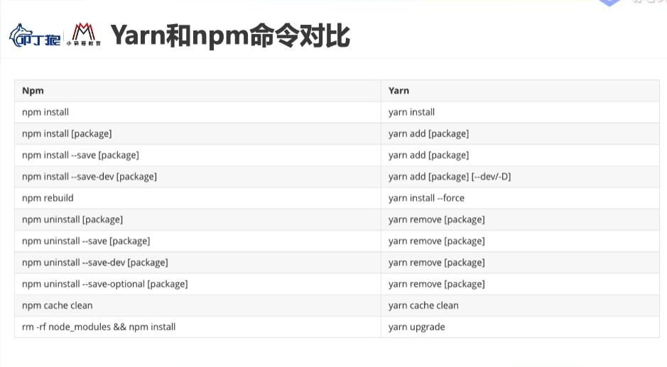

## 前端工程化

现在开发一个项目，不再是简单的几个js文件组成的小项目，而往往是非常庞大和复杂的项目，为了搭建一个项目，我们至少要考虑以下几个点：

+ 项目目录结构如何组织
+ 管理文件之间的依赖关系
+ 管理第三方模块之间的依赖
+ 项目发布前压缩、丑化、打包、发布等
+ css可能是使用less、sass这种预处理器写的，需要转化为普通的css才能被浏览器解析
+ js代码会按照模块化的方案，被写在很多小的js文件中，此时我们需要模块化的技术来管理这些js文件互相之间复杂的依赖
+ 项目需要依赖的第三方库文件需要管理，比如管理它们依赖、版本升级等

为了解决以上这些问题，我们在开发前就要学习一些前端工程化的工具：
+ 比如babel：可以将高版本js代码转化为ES5代码，将jsx转化为react的createElement等，但是需要在项目中手动配置
+ 比如webpack：可以解析less sass，加载一些前端常用的插件、loader等


## 前端脚手架概述
1. 脚手架的作用
帮助我们生成一个通用的目录结构，并且已经将我们所需的工程化环境配置好

2. 常见的前端脚手架工具
Vue脚手架 Vue-cli
React脚手架 create-react-app
Angular脚手架 angular-cli

3. 脚手架搭建的前提条件
所有脚手架都是基于node编写的，所以电脑一定要安装node10+版本
node会默认安装npm包管理工具
所有脚手架都是基于webpack的，所以webpack也要稍微懂点
React脚手架默认使用yarn进行管理安装的包，所以还需要用npm全局安装下yarn工具

4. npm和yarm命令对比表


5. 全局安装淘宝镜像cnpm
npm install -g --registry=https://registry.npm.taobao.org

## 安装并基于脚手架创建react项目

1. 全局安装react脚手架 create-react-app @3.4.1
2. 创建react项目
+ 在命令行工具中输入 create-react-app 项目名称 注意中间有横杠
+ 项目名称不能包含大写字母
3. 创建完成之后，进入对应目录将项目运行
+ 在命令行工具中输入 yarn start运行项目
+ react脚手架创建的项目默认是用yarn启动
+ 其实用npm run start也可以进行启动

4. 下面是一个启动时遇到的webpack版本号不一致的问题
PS C:\Users\克林辣舞\Desktop\react\new_react> webpack --version
webpack 4.44.2
webpack-cli 4.7.2

先全局卸载webpack和webpack-cli
再局部卸载webpack和webpack-cli

全局安装webpack固定版本
全局安装webpack-cli

## 分析脚手架创建的项目文件夹
1. 项目中根目录文件夹下的一些
+ node_modules
+ .gitignore 在将项目提交到github的时候，需要忽略的项目文件名称
+ package.json 项目管理配置文件
+ README.md
+ yarn.lock 记录项目依赖的详细信息
```
比如package.json中版本为：
"react":"^16.13.1" 表示安装的react可以在16.13版本上进行迭代升级
如果别人拿了这个json文件执行了npm install，那么就可能安装16.13.2
这时候就导致同一项目两个开发人员用的项目依赖版本不一致，所以这个yarn.lock就是记录当前项目中每一个依赖的详细版本号和其他信息的
```


2. public
+ favicon 
+ index.html 入口html文件 单页面富应用的文件
+ manifest.json 和web APP 配置有关
+ robots.txt 设置一些爬虫规则

3. src 
+ App.css App根组件相关的css
+ App.js App根组件相关的js 第一个页面展示的
+ App.test.js App根组件的测试代码文件
+ index.css 全局样式文件
+ index.js  整个应用程序入口文件
+ logo.svg logo
+ reportWebVitals.js 默认帮助我们写好的注册PWA相关的代码
web-vitals是Google发起的，旨在提供各种质量信号的统一指南，我们相信这些质量信号对提供出色的网络用户体验至关重要。
其可获取三个关键指标（CLS、FID、LCP）和两个辅助指标（FCP、TTFB）。

[解读新一代 Web 性能体验和质量指标](https://blog.csdn.net/weixin_40906515/article/details/106394217?utm_medium=distribute.pc_relevant.none-task-blog-baidujs_title-9&spm=1001.2101.3001.4242)
+ setupTests 测试初始化文件


## PWA简单介绍
PWA全称Progressive Web App，称为渐进式Web应用
一个PWA应用首先应该是一个网页
在这个网页项目中添加上App Manifest和Service Worker来实现PWA的安装和离线等功能，而这种web网页存在的形式，我们称之为Web App

比如原来手机上打开了一个网页然后关闭了，下次打开的时候手机没网了，那么网页不会显示
PWA对网页进行安装并提供离线的功能

可以将网页添加至主屏幕，就和安装了App一样
可以实现离线缓存功能，及时用户没有网络也可以使用一些离线功能
可以实现消息的推送
可以实现一系列类似于Native App相关的功能

## webpack4.0介绍 
查看webpack的配置信息
在命令行执行npm run eject 便可以查询webpack的详细配置
执行之后会多出来两个文件夹
config：新增配置文件夹
scripts：新增脚本文件夹
package.json中依赖增多了
package.json中script脚本命令变为 "start": "node scripts/start.js",

## src文件详解


+ 从零重写入口文件index.js
执行npm run start 
等于执行node scripts/start.js 这个脚本就要找到src下的index.js入口文件

导入依赖
利用class  + React.Component()方法创建App组件
调用ReactDOM.render()进行渲染

+ 从零重写根组件App.js
将class封装App组件的内容进行剪切，放到一个单独的文件App.js中，避免main.js中内容太多
App.js中同样需要导入react依赖，然后基于export default导出
在App.js进行对象解构 
import react {Component} from 'react'
在mian.js中导入App组件


开发模式：以后将一个个的组件写到一个个xxx.js中，然后按照模块化的规范依次导入即可


## public文件详解
index.html 就是项目启动时看到的第一个页面
下面这行代码用于在移动端桌面安装网页App，不需要，删除
<link rel="manifest" href="%PUBLIC_URL%/manifest.json" />
下面这行代码用于苹果端触摸 不需要，删除
<link rel="apple-touch-icon" href="%PUBLIC_URL%/logo192.png" />

favicon.ico 是网页图标