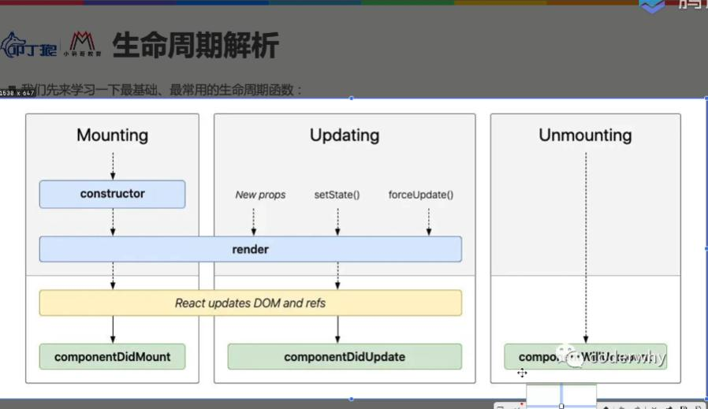

## 一、React组件化开发思想
前端的模块化和组件化都是分而治之这种思想的应用，将页面抽象成一个组件树

+ 尽可能的将一个页面拆分成为一个个小的组件
+ 每个小的组件实现一个独立的功能块，不要让一个组件实现两个功能
+ 封装的组件可以在多个页面进行复用

## 二、React组件和Vue组件的对比
1. 根据组件定义方式
函数式组件 Functional Component
类组件 Class Component

2. 根据组件内部是否有状态需要维护
有状态组件 Stateful Component
无状态组件 StateLess Component

3. 根据组件的不同职责
展示型组件 Presentational Component
容器型组件 Container Component

4. 异步组件
5. 高阶组件

> 从根本上还是关注数据逻辑和UI展示的分离
函数式组件、无状态组件、展示型组件主要关注UI的展示
类组件、有状态组件、容器型组件主要关注数据逻辑的处理

## 三、React常见定义组件的两种方式
### 1. 类组件定义注意点
+ 组件的名称首字母需要大写，App Card 
+ HTML标签本省并不区分大小写，但是在jsx中的HTML标签名必须小写以用来区分组件
+ 类组件需要继承自React.Component类
+ 类组件推荐使用ES6 class关键字定义，由几部分组成：
	constructor构造器可选，里面用于初始化一些数据
	this.state中维护的是组件内部的数据
	render()方法是class组件必须要声明的方法


### 2. 函数式组件定义注意点
```js
export default function App(){
	return (
		<div>
			<h2>我是函数式组件</h2>
		</div>
	)
}
```
+ 函数式组件中没有this对象
函数式组件中压根不存在this绑定的一些问题，相比较类组件中复杂的this绑定这是函数式组件的优点

+ 函数式组件没有内部的状态state，也就是不可以维持内部的状态
在函数内部创建的变量是临时变量，函数执行结束后销毁；下次函数再执行又重新创建，所以状态无法保持，这是函数式组件的缺点
+ 函数式组件中没有生命周期

## 四、React组件中render函数可以返回哪些类型的值

1. 可以return React元素
React元素就是ReactElement,通常用于jsx语法创建

无论是return一个html元素还是一个组件<App/>，都会通过调用React.createElement(div,prop,children)方法创建出来一个ReactElement对象，这个对象会经过ReactDOM.render()方法渲染为DOM节点或者自定义组件。

2. 可以return 数组Array
由于jsx语法规定所有html元素都得有一个根元素，不可以并列写两个元素。
通过下面的数组写法可以实现并列渲染两个组件,数组元素中间记得用逗号隔开
```js
render(){
	return (
		[
			<h2>class类定义组件</h2>,
			<h2>{this.state.message}</h2>
		]
	)
}
```
3. 可以return fragments片段
4. 可以return Portals 可以把返回的这个元素渲染到不同的DOM子树中
5. 可以return 字符串或者数字 它们会被当作文本节点进行渲染
6. 可以return 布尔值或者null 它们不会被渲染


## 五、React组件的生命周期函数
> 只有类组件才有生命周期函数，函数式组件没有生命周期

### 1. React中一个组件从创建到销毁经历了以下几个阶段：

装载阶段Mount：组件第一次在DOM树中被渲染的过程
更新阶段Update：组件状态发生变化，重新更新渲染的过程
卸载阶段Unmount：组件从DOM树移除的过程

### 2. React类组件常见的生命周期函数

componentDidMount：组件已经挂载到DOM上时进行回调
componentDidUpdate：组件已经发生了更新时进行回调
componentWillUnmount：组件即将被移除时进行回调


### 3. 组件从创建到销毁过程中都执行哪些函数

首先进入组件创建和挂载阶段：
> 此阶段依次执行constructor()、render()和componentDidMount()方法
+ 首先创建组件，此时执行类的constructor()方法创建出组件
+ 其次执行类原型上render()方法，此时返回需要渲染的内容也就是ReactElement
+ 然后react开始更新或者挂载组件到DOM树上面，这一步时react内部做的
+ 组件挂载成功之后，执行生命周期函数componentDidMount


更新阶段一般由以下三种情况触发：
+ 给组件传递了新的数据new Props 
+ 调用了this.setState()方法更新组件状态
+ 调用了强制更新的方法this.forceUpdate()

此时进入组件的更新阶段
> 此阶段执行render()和componentDidUpdate()方法
+ 重新调用render函数，返回新的需要渲染的内容ReactElement；
+ 然后react内部开始更新组件的DOM
+ 当组件DOM更新完成之后，执行生命周期函数componentDidUpdate


如果将组件在DOM树中移除了，在移除的时候会调用componentWillUnmount生命周期函数
> 此阶段执行render()和componentWillUnmount()方法

### 4.不同阶段的方法和生命周期函数主要用来执行哪些操作？
> constructor
创建this.state来初始化数据
给jsx中绑定的事件绑定当前类的this实例

> componentDidMount
对DOM的一些操作因为这里已经挂载完成了
发送网络请求
添加一些订阅消息，需要在componentWillUnmount取消订阅

> componentDidUpdate(prevProps,prevState,snapshot)
希望在组件更新之后才进行的DOM操作
需要对更新前后的props进行比较，如果发送变化则发送请求；不发生变化则不请求数据

> componentWillUnmount
清除定时器timer
取消网络请求
清除在componentDidMount中创建的订阅

### 5.几个不常见的生命周期函数
> shouleComponentUpdate
在render函数执行前确定render函数是否要执行从而重新渲染更新视图
return true表示需要调用render();
reurn false 表示不需要调用render()

默认情况下，render函数会被重新调用，但是每次都调用性能比较低,所以这个周期函数中可以做一些优化之类的操作

> getSnapshotBeforeUpdate
在React更新DOM之前调用
可以获取到DOM更新前的一些信息，比如页面滚动位置并return一个对象，这个对象会被componentDidUpdate生命周期函数的第三个参数所接收


## 六、两个补充点
1. 通过git tag命名管理学习代码的思路

通过git打tag，避免多次重复创建项目，每次先通过git回溯到初始化目录
记录二个知识点
打tag之后提交
回溯到初始目录
记录三个知识点
打tag后提交
...
后续只需要切换tag就可以查看不同知识点

先git clone 从线上拉取代码
然后git checkout tag名称 就可以切换到对应tag的代码

2.推荐安装vscode插件 ES7 React/Redux 
安装后直接输入rcc快速生成React代码块
