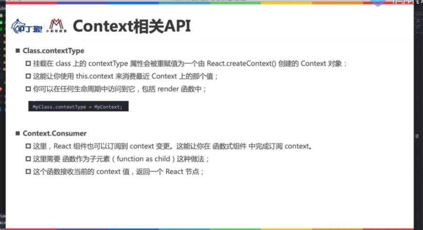
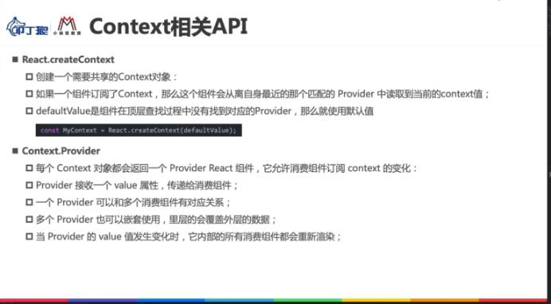

## 一、父组件给子组件传值（基于类组件）
> 不管是函数式组件还是类组件都可以传递数据
```js
子组件ChildCpn中基于this.props接收父组件传递的数据
class ChildCpn extends React.Component{
	constructor(props) {
	    super(props);
		this.props = props;
	}
	render(){
		const {name,age,height} = this.props;
		return (
			<h2>{name + ' ' + age + ' ' + height}</h2>
		)
	}
}

父组件App通过key=value的形式给子组件传递数据
class App extends Component{
	constructor(){
		super();
	}
	
	render(){
		console.dir(React.Component);
		return (
			<div>
				<ChildCpn name='jim' age='18' height='1.88m'></ChildCpn>
				<ChildCpn name='bob' age='20' height='2.03m'></ChildCpn>
			</div>
			
		)
	}
}
ReactDOM.render(<App/>,document.getElementById('app'));
```


## 二、父组件给子组件传值（基于函数式组件）
函数式没有this，直接使用props接收参数，然后解构之后直接使用即可
```js
function ChildCpn(props){
	const {name,age,height} = props;
	return (
		<h2>{name + ' ' + age + ' ' + height}</h2>
	)
}

父组件App通过key=value的形式给子组件传递数据
class App extends Component{
	constructor(){
		super();
	}
	
	render(){
		console.dir(React.Component);
		return (
			<div>
				<ChildCpn name='jim' age='18' height='1.88m'></ChildCpn>
				<ChildCpn name='bob' age='20' height='2.03m'></ChildCpn>
			</div>
		)
	}
}
```
## 三、父组件给子组件传递参数时的类型验证propTypes
### 1.可参考官方文档
[使用 PropTypes 进行类型检查](https://react.docschina.org/docs/typechecking-with-proptypes.html)
### 2.父组件在给子组件传值时进行参数验证的方法

A. 项目中默认继承了TypeScript可以直接进行类型验证
B. 通过使用脚手架搭建的prop-types库 ,可以在封装组件和传参时进行简单的参数验证等需求
注意：从react15.5版本开始 原来的React.PropTypes类移入到单独的prop-types包中

### 3.函数式子组件进行参数验证和赋默认值的方法

> 注意点
+ 由于prop-types现在是一个第三方包，所以需要先到导入才可以使用，注意导入时的大小写
import PropsType from 'prop-types'; 
将prop-types导入用变量PropsType来接收

+ 在添加参数验证的时候ChildCpn.propTypes = {name:PropTypes.number} 
添加在子组件身上的属性首字母是小写的propTypes
添加类型验证时需要调用导入的类上面的属性，所以PropTypes是一个类，首字母大写

> 在函数式组件中进行参数验证和赋默认值,只可以用下面这种把构造函数当做对象添加私有属性的写法
等于将ChildCpn当做一个构造函数，函数也是对象，给对象本身添加私有属性propTypes和defaultProps
```js
function ChildCpn(props){
	const {name,age,height} = props;
	return(
		<div>
			<h2>{name + ' ' + age + ' ' + height}</h2>
		</div>
	)
}
ChildCpn.propTypes = {
	name:PropTypes.string.isRequired, //参数类型为string并且为必传参数
	age:PropTypes.number,
	height:PropTypes.string,
}
// 只要有默认值 传入isReuired也不会报错
ChildCpn.defaultProps = {
	name:'456',
	age:36,
	height:'1.98',
}
```

### 4.类子组件进行参数验证和赋默认值的方法
原理是给类添加静态属性，也就是不可被后代子类所继承的属性，添加的方法和函数式组件一样
如果一个子组件是类组件，那么既可以采用static方法，也可以采用写在类外面添加私有属性的方法，都是可以的
```js
import PropsType from 'prop-types';
class ChildCpn extends React.Component {
	render(){
		const {name,age,height} = this.props;
		return (
			<div>
				<h2>{name + ' ' + age + ' ' + height}</h2>
			</div>
		)
	}
	static propTypes = {
		name:PropTypes.string.isRequired, //参数类型为string并且为必传参数
		age:PropTypes.number,
		height:PropTypes.string,
		boys:PropTypes.array,
	}
	
	static defaultProps = {
		name:'456',
		age:36,
		height:'1.98',
		boys:[15,16,17,18,19,20]
	}
	
}
```


## 四、为什么类组件内部不写constructor构造函数也可以在render函数中获取到父组件传递过来的props的值

不是每个组件都必须显式的在类里面声明constructor函数，并且像下面这样使用props中的值：
1. 先通过参数props接收父组件传递的所有参数
2. 然后将props的值赋值给this.props
3. 之后才可以在类的render函数中使用this.props中父组件传递的属性值
```js
constructor(props) {
	super(props);
	this.props = props;
}
render(){
	const {name,age,height} = this.props;
	return (
		<h2>{name + ' ' + age + ' ' + height}</h2>
	)
}
```

### 原因1：React.Component类的源码
React.Component类的第一个参数就是props，这是因为react中的所有类组件都需要继承自React.Component类，并且都有可能接收来自父组件传递的参数并保存在props中，基于这个需求，这个React.Component类直接将所有子类都需要的属性props放在了自己的构造函数中，这样子类只需要调用super(props)其实就是Component.call(this,props)便可以在子类的实例上获取到一个props属性。
```js from ReactBaseClasses
function Component(props, context, updater) {
  this.props = props;
  this.context = context;
  // If a component has string refs, we will assign a different object later.
  this.refs = emptyObject;
  // We initialize the default updater but the real one gets injected by the
  // renderer.
  this.updater = updater || ReactNoopUpdateQueue;
}
```

### 原因2：根据面向对象中类的call继承原理
ES6中类的继承其实是ES5中继承的另外一种更加面向类的写法：
> super(props)其实本质是Father.call(this,props)
这也就意味着在子类的构造函数中将父类的构造函数执行了一遍，并且执行的时候this指向子类的this实例，所以super(props)等于当前子类的this实例上继承了父类的props属性。

综上所述：基于Component类的源码和面向对象的call继承原理，只要子组件的constructor中调用了super(props)方法，那么此时props属性就自动会被添加到子组件实例对象上，从而可以在子组件的其他方法中通过解构赋值的方法或者直接通过this.props.xxx使用父组件传递的参数渲染自己组件的DOM，实现组件的高度复用和可定制化。

### 原因3：react在内部默认添加了constructor函数
其实React中创建的类组件，都默认为每一个组件添加了constructor函数并且在其内部执行了super(props)函数，也就是每一个组件在创建的时候已经默认有一个props属性在当前类的实例上，所以可以直接使用jsx语法使用this.props对象。

>>> 所以上面代码可以简化为：
```js
class Son extends React.Component{
	render(){
		const {name,age,height} = this.props;
		return (
			<h2>{name + ' ' + age + ' ' + height}</h2>
		)
	}
}
```


## 五、源码解读：当父组件给子组件传值的时候，为什么以下情况都不会报错？
前提：我们在进行父子组件传值的时候，父组件通过key value的形式给子组件进行传递参数，子组件内部通过其自身props属性获取父组件传递的值。按照常理，需要在子组件的构造函数constructor中接收props参数，然后调用super(props)创建一个父类的实例，最后完成this.props = props的赋值，此时子组件的实例才有了props属性，也成功接收了父组件传递的值。

但是以下四种情况为什么都可以再render函数和DidMount生命周期中拿到值呢？

### 1.this.props的不同情况
下面这四种情况无论是否在构造函数constructor中获取到this.props的值，但是在render函数中无一例外都可以正确的获取到父组件传递的this.props的值，从而进行数据渲染。
直接省略不写constructor构造函数，那么在render函数中也是可以正确获取到this.props的值的

为什么无论如何在render函数中和componentDidMount生命周期函数中都可以拿到props的值并且添加在了子组件的this实例上，react在这里做了怎样的处理？

```js

constructor(){
	super();
	console.log(this.props); // undefined
}

constructor(props){
	super();
	console.log(this.props); // undefined
}

constructor(props){
	super();
	this.props = props;
	console.log(this.props); // 父组件传递的数据可以正常获取 因为上一步已经进行了赋值
}

constructor(props){
	super(props);
	console.log(this.props); // 父组件传递的数据可以正常获取 因为super(props)本质是将props保存在了子组件的实例上，虽然调用的是父组件的方法
}
```

### 2.补充：JSX语法写的HTML模板被如何渲染为ReactElement对象
JSX写的HTML模板通过React.createElement(type, config, children)方法最终渲染成为一个ReactElement对象(js对象)
然后调用ReactDOM.render(ReactElement,要挂载的DOM元素对象)方法将真实DOM渲染出来
```js
export function createElement(type, config, children) {
	...
	return ReactElement(
	  type,
	  key,
	  ref,
	  self,
	  source,
	  ReactCurrentOwner.current,
	  props,
	);
}
参数1：type
type表示当前element的类型
如果是HTML标签，直接写字符串类型的标签名即可，如'div','span','a'等
如果是组件元素，直接写组件名称即可,如App,Loading

参数2：config
config以对象键值对的形式表示当前element的属性，如css属性，元素内置属性等等

参数3：children
children表示存储在元素中的内容，以children数组的方式进行存储
如果是多个元素，React中源码处理下面会说
```
### 3.补充：ReactElement对象长什么样子？和真实的JSX语法想比较呢？

```js JSX写法
class App extends React.Component {
	constructor(){
		super();
	}
	render(){
		const elementObj =  (
			<div className="App">
			  <div className="header">
				  <p>啊哈哈哈</p>
			  </div>
			  <div className="content">
				  <p>6666</p>
				  <a href="https://www.baidu.com"></a>
			  </div>
			  <div className="footer">
				  <p>9898998</p>
			  </div>
			</div>
		)
		return elementObj;
		
	}
}
ReactDOM.render(<App/>,document.getElementById('app'));

```

将上面的JSX转化为ReactElement之后就是下面的js对象：

```js ReactElement写法
ReactElement = {
	$$typeof: Symbol(react.element)
	key: null
	props:{
		children: [
			0: {$$typeof: Symbol(react.element), type: "div", key: null, ref: null, props: {…}, …}
			1: {$$typeof: Symbol(react.element), type: "div", key: null, ref: null, props: {…}, …}
			2: {$$typeof: Symbol(react.element), type: "div", key: null, ref: null, props: {…}, …}
		]
		className: "App"
	}
	ref: null
	type: "div"
	_owner: FiberNode {tag: 1, key: null, stateNode: App, elementType: ƒ, type: ƒ, …}
	_store: {validated: false}
	_self: null
	_source: null
}
```
### 4.查看源码
+ 源码路径
packages--- react-test-render---src---ReactShallowRenderer.js

+ 官方网站路径
教程--官网Api--Test Render

+ react-test-render包的作用
这个 react-test-render package包 提供了一个 React 渲染器，用于将 React 组件渲染成纯 JavaScript 对象，无需依赖 DOM 或原生移动环境。任何一个React中的组件都需要经过这个包中的一些东西渲染为纯JS对象。

+ ReactShallowRenderer.js的作用：
将组件渲染为js对象，主要就是靠ReactShallowRenderer这个类来进行渲染的
_element其实就是对应的ReactElement对象
_instance其实就是对应的ReactElement组件对象

部分源码如下：
```js
class ReactShallowRenderer {
	constructor(){
		this._reset();
	}
	赋初始值
	_reset(){
		this._element = null;
		this._instance = null;
	}
	取出element为ReactElement对象，因为这个ReactElement对象上有props属性
	render(element: ReactElement){
		
		if(this._instance){
			如果存在组件对象 做一个更新操作
		}else{
			如果不存在 判断elementType是否为一个构造器  elementType其实就是子组件的名字如ChildCpn
			if(shouldConstructor(elementType)){
				如果是构造器 那么就通过new 创建一个组件的实例对象
				this._instance = new elementType(element.props,...)
				
				//等于下面这个
				this._instance = new ChildCpn(element.props,...)
			}
		}
		
	}
	_mountClassComponent(
	  elementType: Function,
	  element: ReactElement,
	  context: null | Object,
	) {
	  // 取出ReactElement上的props，再给当前的实例_instance赋值一遍，这句是核心
	  this._instance.props = element.props;
	  // 调用实例的render函数，因为上一步已经给实例的props赋值了，所以这里调用实例的render函数的时候怎么都可以获取到this.props。这就符合之前那四种情况的判断
	  this._rendered = this._instance.render();
	}
}

```
### 5.react为什么要这样做？
因为react它是怕开发者在创建类组件的时候忘记写constructor或者忘记调用super(props)这个方法，所以react不管开发者写不写，它都会在内部帮助我们把流程走一遍。


## 六、子组件给父组件传递参数（基于函数传递）
在VUE中通过自定义函数来完成this.emit('自定义事件',props)
React中子组件给父组件传递参数还是通过props传递参数，只不过父组件传参的时候传递的是父组件内部一个函数的引用，注意是函数的引用。

原理：子组件中某个事件触发的时候，想要修改父组件中state的值，需要经过以下四个步骤：
首先父组件中定义好一个修改自身state的方法假设方法名为changeFatherState
然后父组件需要将内部定义好的这个函数引用名称告诉子组件，这一步就是在父组件中使用子组件时传值的过程
然后子组件此时通过props拿到了父组件中的函数引用（等于拿到了开启修改父组件中状态的钥匙）
然后子组件的某个事件触发的时候，将事件回调函数写成props中拿到的这个函数引用即可


1. 首先封装一个子组件CounterButton
+ 子组件CounterButton中会用到父组件传递的btnName和btnType的值（类似Vue的父传子）
+ 子组件CounterButton中会用到父组件传递的children(类似Vue的插槽)
+ 子组件CounterButton中会用到父组件传递的自定义函数，也是键值对的方式,但是原理不同

```js
class CounterButton extends Component{
	render(){
		const {sonBtnClick,btnDesc,btnType} = this.props;
		return(
			<div>
				// btnType和btnDesc等于就是普通的父组件传递的参数
				// sonBtnClick才是父组件传递给子组件的其内部可以改变state方法的函数引用
				<button onClick={(e)=>{sonBtnClick(e)}}>{btnDesc+':' + btnType}</button>
			</div>
		)
	}
}
```

2. 其次将封装的子组件在父组件中使用，父组件通过键值对将函数引用传递给子组件

```js
class Father extends Component{
	constructor(props){
		super(props);
		this.state = {
			counter:0,
		};
	}
	render(){
		return (
			<div>
				<h2>当前计数：{this.state.counter}</h2>
				<CounterButton 
					sonBtnClick={(e)=>{this.increment(e)}} 
					sonBtnClick={this.increment.bind(this)}
					btnDesc="这是一个按钮" 
					btnType="+++"
				/>
			</div>
			
		)
	}
	<!-- increment就是在父组件中定义好的用于修改自身state的方法 目的就是将此函数引用传递给子组件 -->
	increment(e){
		this.setState({
			counter:this.state.counter+1,
		})
	}
}
```


## 七、关于react中组件的样式编写
1. 可以在组件中采用JSX语法的style={{key：value}}的形式为元素设置样式，但是太过复杂而且耦合度高
2. 采用先定义className，然后编写样式文件，最后倒入样式文件让当前组件与其倒入的样式产生依赖即可
由于react脚手架是基于webpack构建的项目，webpack在编译的时候会从index.js入口文件依次收集依赖并且完成最后的打包
所以在index.js中导入一个css文件，那么这个css文件中的样式就会在全局生效，这个和Vue中main.js中是一个道理，也是挂载全局样式的一个方法

下面这个代表导入的main.css中的样式会在全局生效，基于这个特点我们可以为单个组件写一个对应的css文件然后按照className依次导入依赖即可
```js 入口文件index.js
import React from 'react';
import ReactDOM from 'react-dom';
import App from './Profile2'
import './style/main.css'

ReactDOM.render(
	<App/>,
	document.getElementById('root')
)
```

3. 在React中为一个元素动态添加class类名的技巧
title后面必须加一个空格
<div className={'title ' + (currentIndex===index?'active':'')} ></div>

4. this.state中定义的是之后要发生改变的数据，当这些数据发生改变的时候会重新执行render函数执行渲染，如果是固定的数据，我们一般不直接写在state中，而是采用下面两种方法直接写在this实例上即可：
第一种：直接写this.titles=固定的数据
第二种：在构造函数外面写 titles = 固定的数据
```js
class App extends React.Component {
	title = []; ES6新增写法 其实本质和上面一样 都是在类的实例上添加一个属性
	constructor(){
		this.title = []; 直接将固定数据在构造函数执行时写在title属性上
	}
} 
```

## 八、父子组件通信案例练习

### 需求：实现一个tababr
+ 父组件传递给子组件一个数组比如[a,b,c]，子组件接收到父组件传递的数组，并且按照等分布局进行排列
+ 子组件默认将数组中第一个展示的a有一个active的效果，比如文字变红色并且底部有一个下划线
+ 当用户点击子组件上的abc时，active效果可以切换，并且子组件可以告诉父组件当前被点击的哪一个item的内容和索引
+ 父组件中拿到子组件传递的被点击的item的内容和索引，然后在父组件的其他地方展示出来

### 子组件TabControlItem具体实现
```js
class TabControlItem extends Component{
	constructor(props){
		super(props);
		this.state = {
			currentIndex:0,
		}
	}
	
	
	itemClick(item,index){
		this.setState({
			currentIndex:index,
		})
		this.props.sonItemClick(item,index);
	}
	
	
	render(){
		const {titles} = this.props;
		const {currentIndex} = this.state;
		return(
			<div className="containter">
				{
					titles.map((item,index)=>{
						return (
						<div className="title" 
							 key={index} 
							 onClick={(e)=>this.itemClick(item,index)}
						>
							<span className={currentIndex===index?'title-active':null}>{item}</span>
						</div>)
					})
				}
			</div>
		)
	}
}
export default TabControlItem;
```
### 父组件TabControl具体实现
```js
import './style.css';
class TabControl extends Component{
	constructor(props){
		super(props);
		this.state = {
			currentTitle:'语文',
			currenIndex:0,
		};
	}
	
	changeTab(item,index){
		this.setState({
			currentTitle:item,
			currenIndex:index,
		})
	}
	
	render(){
		const {currentTitle,currenIndex} = this.state;
		return(
			<div className="tab-control">
				<TabControlItem 
					titles={['语文','历史','地理']}
					sonItemClick={(item,index)=>{this.changeTab(item,index)}}
				>
				</TabControlItem>
				<h2>{currentTitle}</h2>
				<h2>{currenIndex}</h2>
			</div>
		)
	}
}
export default TabControl;
```


## 九、在React中实现类似于Vue中插槽的功能
### 1. 概述
其实插槽也是一种父组件给子组件传递数据的形式，只不过跳开了通过键值对传值在子组件中通过props拿值的操作，而是可以直接将一些父组件中已经定义好的ReactElement或者大量的数据直接传递给子组件。

在React中没有插槽概念，如果要实现可以用JSX语法直接把父组件想要传递给子组件的东西当做数据/变量传递给子组件，所以React根本就不需要插槽
### 2. 举例
以京东的移动端多个页面的顶部导航栏为例，每个页面对于其导航栏的需求都不一样，不可能每个页面都写一个自己的导航栏组件,正确的做法是封装一个导航栏子组件，然后使用这个导航栏组件的父组件把要展示的内容传递给子组件，子组件拿到后进行样式的布局和数据的展示，值得注意的是这里父组件可以直接传递一个类似JSX写的组件过去。

+ 首页页面导航栏：更多按钮 + 搜索框 + 登录
+ 商品详情页面导航栏：返回按钮 + 搜索框 + 空白
+ 登录页面导航栏：返回按钮 + 页面标题
+ 商品介绍页面导航栏：返回按钮 + [商品 评价 详情 推荐] ···导航栏

### 3. 子组件中拿到数据之后怎么做？
+ 按照父组件传递的个数进行样式的布局和所占宽度的分配
+ 拿到数据然后进行对应的展示

### 4. React实现插槽方案一：基于props.children属性

将父组件要传递给子组件的内容(组件)放在双标签的中间
父组件在双标签内部写要传递的内容，注意不是键值对，是JSX语法的组件
子组件在props.chldren里面拿到，但是具体怎样在子组件中排列的事情由子组件来进行

参考源码:react-index.js-createElement方法 该方法就是创建ReactElement对象的方法，它接收一个config参数，这个props参数接收的都是所有元素以键值对排列的属性。然后先新建一个props空对象，遍历config对象，然后将所有config中的属性放到新建的props中，再将props一起传递给子组件实例对象中，这就是为什么父组件传递的属性在子组件的props中可以拿到。同理：所有子组件的子元素放在children参数中，然后遍历之后，最终将所有children放到props中

>>> 子组件中基于this.props.children接收数据，然后基于自己的css进行排列，最后基于索引进行展示数据
```js
class TabBar extends React.Component {
	constructor(props){
		super(props);
		
	}
	render(){
		console.log(this.props);
		const {children} = this.props;
		return (
			<div className="tab-bar">
				<div className="left">{children[0]}</div>
				<div className="center">{children[1]}</div>
				<div className="right">{children[2]}</div>
			</div>
		)
	}
}
```

>>> 父组件中在子组件中间传递值,会严格的按照顺序依次将值传递到子组件的props.children数组中保存
这种传递的缺点是子组件要想使用必须得按照索引来取，并且一旦父组件中传递的顺序变了，子组件也要响应改动，不能实现类似Vue的具名插槽那种精确的插槽，只适合与父组件传递单个东西给子组件的时候可以采用这种方案。
```js
import TabBar from './TabBar/TabBar'
class Home extends React.Component {
	render(){
		const {value} = this.state;
		return(
			<div>
				<TabBar>
					<span>返回</span>
					<input />
					<span>分享</span>
				</TabBar>

			</div>
		)
	}
}

```

### 5. React实现具名插槽：基于JSX可以直接将组件当做一个数据进行传递
>>> 父组件通过：插槽名称={组件或者HTML标签及数据}传递
父组件中基于键值对传值，子组件可以是单标签写，但是传递的值不是普通的jS数据类型，而是一个JSX语法写的HTML标签或者React组件
```js
import TabBar from './TabBar/TabBar'
class Home extends React.Component {
	render(){
		const {value} = this.state;
		return(
			<div>
				<TabBar2
					leftSlot={<span>返回</span>}
					centerSlot={<span>商品详情</span>}
					rightSlot={<span>更多</span>}
				/>
			</div>
		)
	}
}

```

>>> 子组件通过props['插槽名称']拿到值，然后进行布局和渲染
```js
class TabBar2 extends React.Component {
	constructor(props){
		super(props);
		
	}
	render(){
		console.log(this.props);
		const {leftSlot,centerSlot,rightSlot} = this.props;
		return (
			<div className="tab-bar">
				<div className="left">
					{leftSlot}
				</div>
				<div className="center">
					{centerSlot}
				</div>
				<div className="right">
					{rightSlot}
				</div>
			</div>
		)
	}
}
```


## 十、React中跨组件通信方案

### 1. 基于props属性层层传递【不推荐】
这种方案是可以实现跨组件传递数据的，但是很多中间层其实都用不到任何关于子组件中所需的属性和数据，但是为了传递还要写一遍，而且当嵌套层数太深的话代码看起来太乱了
### 2. 在原来的基础上使用React的Spread Attributes实现简写
通过Spread Attributes这种JSX自带的语法可以实现简写，但是没有从根本解决问题
Spread Attributes这种写法不是对象展开运算或者解构，而是一种JSX的特殊写法

>Spread Attributes语法如下：
```js
function Middle1(){
	return (
		<div name="lilei" age="100"></div>
	)
}

function Middle2(){
	const props = {name:'lilei',age:100};
	return (
		<div {...props}></div>
	)
}
```

### 3. 基于props属性实现爷-父-子传递的一个小案例
> 爷爷组件---父组件---子组件，现在需要将爷爷组件中数据传递给子组件，并且在子组件中的其他地方进行展示
```js
import React from 'react';

// 孙子组件
function Header(props){
	const  {nickName,level} =props; 
	return (
		<div>
			<h2>这是头部孙子组件，记录用户信息</h2>
			<h3>用户昵称:{props.nickName}</h3>
			<h3>用户等级:{props.level}</h3>
		</div>
	)
}


// 父组件
function Profile(props){
	return (
		<div>
			<Header nickName={props.nickName} level={props.level}></Header>
			<Header {...props}></Header> // Spread Attributes实现简写
			<h2>这是父组件的内容</h2>
			<h3>这是一个998级的用户</h3>
		</div>
	)
}


// 爷爷组件
class App extends React.Component {
	constructor(props) {
		super(props);
	    this.state = {
			nickName:'Tom',
			level:1005
		}
	}
	render(){
		const  {nickName,level} = this.state; 
		return(
			<div>
				<Profile nickName={nickName} level={level}></Profile>
				<Profile {...this.state}></Profile> // Spread Attributes实现简写
			</div>
		)
	}
}
```

### 4. 基于React提供的Context API来实现跨组件传递数据
Context提供了一种在组件之间共享此类值的方式，而不必显式的通过组件树的逐层传递props
> 实现步骤：[假设我们要将A组件中值跨过B组件传递给C组件]

第一步：基于React.createContext(defaultValue)创建共享context对象，假设为UserContext对象
第二步：在A组件中基于上一步创建的UserContext.Provider组件，将B组件包裹在UserContext.Provider组件内部，UserContext.Provider组件接收一个value参数，value中写的就是A组件中要传递给C组件的值，如果什么都不写那么会传默认值。
第三步：在C组件外面通过C.contextType = UserContext，保证在组件的this实例对象上可以拿到context对象
第四步：在C组件的render函数中调用this.context获取到A组件传递的数据，然后使用

```js
import React from 'react';
const UserContext = React.createContext({
	nickName:'wade',
	level:998
})

class Header extends React.Component{
	constructor(props) {
	    super(props);
		console.log(this.context);//undefined
	}
	render(){
		console.log(this.context);
		const {nickName,level} = this.context;
		return (
			<div>
				<h2>这是头部孙子组件，记录用户信息</h2>
				<h3>用户昵称:{nickName}</h3>
				<h3>用户等级:{level}</h3>
			</div>
		)
	}
}
Header.contextType = UserContext;


// 父组件
function Profile(props){
	return (
		<div>
			<Header></Header>
			<h2>这是父组件的内容</h2>
			<h3>这是一个998级的用户</h3>
		</div>
	)
}

// 爷爷组件
class App extends React.Component {
	constructor(props) {
		super(props);
	    this.state = {
			nickName:'God like',
			level:100
		}
	}
	render(){
		return(
			<div>
				<UserContext.Provider value={this.state}>
					<Profile></Profile>
				</UserContext.Provider>
			</div>
		)
	}
}
```

> 在函数式组件中获取不到this.context,改用Consumer实现
虽然跨组件数据传递会用Redux来实现，还是可以了解下
其他步骤和前面一模一样
UserContext.Consumer不仅可以在函数式组件中使用，也可以在类组件中使用，而且是多个context更加适合和推荐使用的方法。
```js
function Header(){
	return(
	<UserContext.Consumer>
		{
			value=>{
				return (
					<div>
						<h2>这是头部孙子组件，记录用户信息</h2>
						<h3>用户昵称:{value.nickName}</h3>
						<h3>用户等级:{value.level}</h3>
					</div>
				)
			}
		}
	</UserContext.Consumer>
	)
}

```

> 多个context的用法【待补充】
React中Context相关API



## 十一、跨组件通信之基于events库进行全局事件数据传递

### 什么是事件总线？
事件总线也叫eventBus：本质是一个全局的对象，通过new调用构造函数EventEmitter来生成一个全局事件对象，这个全局事件对象有具有很多可以发射、接收、移除全局事件的属性和方法，基于它的这些能力，我们可以进行跨组件间的参数传递。

事件总线在很多前端框架中都有，比如Vue和React中都有这个概念。

### 用法
1. 安装events库
```js
yarn add events --save
npm i events --save
```
2. 导入EventEmitter类用于创建全局事件对象

如果导入的模块来自于本地文件 写一个相对路径./ 
如果导入的模块来自于node_modules 直接写路径即可
```js
import {EventEmitter} from "events";
console.log(EventEmitter)；
EventEmitter是一个类，类也是一个对象,类的原型上具有很多方法。
{
	EventEmitter: ƒ EventEmitter()
	defaultMaxListeners: (...)
	init: ƒ ()
	listenerCount: ƒ (emitter, type)
	once: ƒ once(emitter, name)
	prototype：{
		addListener: ƒ addListener(type, listener)
		emit: ƒ emit(type)
		eventNames: ƒ eventNames()
		getMaxListeners: ƒ getMaxListeners()
		listenerCount: ƒ listenerCount(type)
		listeners: ƒ listeners(type)
		off: ƒ removeListener(type, listener)
		on: ƒ addListener(type, listener)
		once: ƒ once(type, listener)
		prependListener: ƒ prependListener(type, listener)
		prependOnceListener: ƒ prependOnceListener(type, listener)
		rawListeners: ƒ rawListeners(type)
		removeAllListeners: ƒ removeAllListeners(type)
		removeListener: ƒ removeListener(type, listener)
		setMaxListeners: ƒ setMaxListeners(n)
	}
}

```

3. 生成全局事件对象
```js
const eventBus = new EventEmitter();
eventBus是全局事件对象，它上面的_event属性中存放着一个个的全局事件.
全局事件对象可以调用的方法都是通过__proto__原型链来调用的。
{
	_events: {showAppCpnData: ƒ}
	_eventsCount: 1
	_maxListeners: undefined
	__proto__: {
		addListener: ƒ addListener(type, listener)
		emit: ƒ emit(type)
		eventNames: ƒ eventNames()
		getMaxListeners: ƒ getMaxListeners()
		listenerCount: ƒ listenerCount(type)
		listeners: ƒ listeners(type)
		off: ƒ removeListener(type, listener)
		on: ƒ addListener(type, listener)
		once: ƒ once(type, listener)
		prependListener: ƒ prependListener(type, listener)
		prependOnceListener: ƒ prependOnceListener(type, listener)
		rawListeners: ƒ rawListeners(type)
		removeAllListeners: ƒ removeAllListeners(type)
		removeListener: ƒ removeListener(type, listener)
		setMaxListeners: ƒ setMaxListeners(n)
	}
}
```

4. 在A组件中发射全局事件并携带参数
基于eventBus.emit()方法来发射全局事件
第一个参数为事件的名称，可以是字符串或者symbol；
从第一个参数开始之后，可以传递多个参数，用逗号隔开
```js
showData = ()=>{
		console.log(888)
		eventBus.emit('showAppCpnData','666',this.state.data)
	}

```

5. 在Z组件中接收全局事件并接受参数
在组件的componentDidMount生命周期内基于eventBus.addListener()监听全局事件
第一个参数是事件名称
第二个参数是全局事件的回调函数Listener

> 为了方便后面remove取消，建议这里将函数封装起来，要不然后面在remove的时候会将该全局事件从全局直接移除，而不是仅仅从当前组件中移除监听。

> 事件处理函数的this要注意，必须经过绑定bind或者箭头函数来写，否则该事件处理函数中的this是eventBus全局对象而不是当前的组件实例。

> 全局事件发射时传递的参数可以在事件处理函数的形参中用...args来接收，args是一个数组。
```js
componentDidMount(){
	eventBus.addListener('showAppCpnData',this.handleShowAppCpnData);
}

// showAppCpnData全局事件的Listener事件回调函数
handleShowAppCpnData= (...args) =>{
	console.log(args);  // 参数列表
	console.log(this); // 组件实例
	this.setState({
		appNumber:args[0],
		appString:args[1]
	})
}

```

6. 在Z组件卸载前移除对于该全局事件的监听，避免内存泄漏
在组件的componentWillUnmount生命周期内基于eventBus.removeListener()移除当前组件对于全局事件的监听
```js
componentWillUnmount(){
	eventBus.removeListener('showAppCpnData',this.handleShowAppCpnData)
}
```


