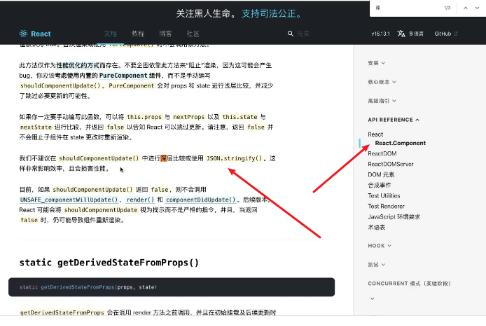

## React性能优化概述
在React中将性能优化分为两个方向去考虑：
第一个方向是在组件触发其内部更新机制调用render函数，重新开启一个更新流程的时候，尽可能高效的去更新虚拟DOM；

第二个方向是在多个组件嵌套的页面中，尽可能的只调用哪些和state或者props产生了依赖的组件的render函数，而不是每次都将父组件内部所有子组件的render函数都调用一次。

基于对React的性能优化暂时只针对于以上两个方向来进行。

## React内部的渲染机制

JSX语法写的组件基于React.createElement()转化成为JS对象，也就是虚拟DOM ReactElement。然后再调用ReactDOM.render(ReactElement,documnetElement)将虚拟DOM转化为真实DOM，渲染在页面上。

## React内部的更新流程
1. 当组件的props或者调用setState()方法修改了state中的值时，此时会触发React的更新流程
2. 首先重新执行一次render函数
3. 执行render函数就会走一遍JSX--ReactElement(虚拟DOM)--真实DOM的过程，当然React不会直接将真实DOM渲染出来，而是先会生成本次一颗本次更新的虚拟DOM树
4. 将第一次渲染时形成的旧的虚拟DOM树和本次更新形成的新虚拟DOM树进行对比，对比的目的是找出两颗虚拟DOM树之间的差异以便于更加高效的更新虚拟DOM；对比运用的算法一种经过React优化的diff算法。
5. 通过diff算法会计算出两棵树的对比差异，然后进行patch打补丁操作，也就是在虚拟DOM中完成更新
6. 将虚拟DOM渲染到真实DOM，此时React内部的一次更新流程到此结束。

## React更新虚拟DOM的算法--Diff算法详解

### 1.React为什么要采用diff算法来计算两颗新旧虚拟DOM树的差异？
两棵不同的树结构进行diff算法对比的时候，最终目的是将对比前后的两颗树中相同的地方进行复用，将不同的地方进行修改，然后将修改后的虚拟DOM更新到真实DOM里面，这种方法要不全部更新整颗虚拟DOM树节省性能。


### 2.React内部对于递归对比DOM节点的这种算法是如何进行优化的？

> A：原始的递归对比DOM节点的算法复杂度太高
递归对比DOM节点的这种算法将每一个新的虚拟DOM节点进行递归比较，此算法的复杂程度是O(n³)，n是树中元素的数量。即时是最先进的算法，如果树中有1000个元素需要执行计算，那么计算量也将在十亿的量及范围，这对于性能优化太过于不友好。React对于原来的递归对比虚拟DOM节点的算法进行了如下的优化，将算法复杂度优化成了O(n)。

>B: React是如何将算法复杂度从O(n³)变为O(n)的？

+ 只对两颗树的同层次节点进行互相比较，不进行跨层次的节点比较
+ 如果某一个节点的节点类型发生了变化，那么会直接将该节点树删除，生成一颗新的节点树挂载上去
比如原本body节点下的div节点（此节点下还有十个子节点），经过更新之后变成了P节点（此节点下有8个子节点），那么这属于节点类型发生变化，此时React会进行如下操作
   先将原来div节点及其子节点形成的那颗子DOM树进行删除
   生成一个p节点及其子节点形成的新的子DOM树
   将这个P节点的子DOM树挂载到其对应的新的虚拟DOM节点上，完成节点的替换
+ 开发中，可以通过key来指定哪些节点在不同的渲染下保持稳定，后面有详细介绍

### 3.diff算法在进行计算时不同情况的处理方法

#### 情况一：对比不同类型的元素
当前后对比的两颗树中有不同的元素的时候，Raeat会将原先div节点及其内部Header组件全部卸载，然后重新建立一个p节点下的新的子树。这里的Header组件其实也会跟着进行一个从销毁到重新创建的过程,而不会对Header组件进行一个复用。

```js
<div>
	<Header></Header>
</div>

<p>
	<Header></Header>
</p>
```
+ diff算法对比时发现元素类型从div节点变为p节点，此时触发完整的重建流程
+ 卸载div这颗子树，其下面的所有DOM节点都会被卸载，所以Header组件也会被卸载，Header组件实例会执行componentWillUnmount()方法，代表即将卸载Header组件
+ 新建p这颗子树，对应的DOM节点也会被创建并插入到DOM应有的位置中，此时Header组件被重新创建，那么组件实例将会执行componentWillMount以及componentDidMount方法，代表组件即将挂载和组件已经挂载完成。

#### 情况二：对比同一类型的元素

> 如果是两个同类型的React元素
当对比两个节点类型相同React元素的时候，React元素会保留DOM节点，仅仅对比更新改变的属性，不过这个属性既包含元素自身属性也包含元素的style样式属性。如下所示：更新前后diff算法只会将className属性进行更新，DOM节点并不会被重新销毁然后创建。
```js
<div className="before" title="hello"></div>
<div className="after" title="hello"></div>
```

> 如果是两个同类型的组件元素
组件也会保持不变，React会更新该组件的props，并且调用componetWillReceiveProps()和componentWillUpdate()方法；然后调用组件的render函数，diff算法将在之间的结果以及新的结果中进行递归。

#### 情况三：对子节点进行递归
默认情况下递归对比DOM节点的子元素时候，React会同时遍历两个子元素的列表，当产生差异的时候会产生一个mutation（变化）。如下在diff算法进行递归对比的时候，diff算法在对比前两个li的时候不会产生mutation，但是在对比到第三个li的时候会产生一个新的mutation，然后将这个新的mutation更新到真实DOM中即可。

但是diff算法这种默认递归对比子元素的方法有一个问题，那就是假如我在中间或者头部插入一个新的li节点，按照理想的状态React并不需要改变原来的first或者second节点，只需要将新产生的li节点移动到头部或者中间即可，但是React内部并不是按照理想状态处理的，而是会从头开始递归对比，此时就会产生多个不必要的mutations，当列表元素多的时候，对性能消耗很大。

```js
<ul>
	<li>first</li>
	<li>second</li>
</ul>

<ul>
	<li>first</li>
	<li>second</li>
	<li>插入到尾部的元素</li>
</ul>

<ul>
	<li>要插入到头部的元素</li>
	<li>first</li>
	<li>second</li>
</ul>

```


## React在进行列表渲染时key的作用
1. 概述
为了解决上面提到的diff算法在对比子节点的时候默认进行递归的方法太过于消耗性能，React推荐我们在渲染列表的时候给每一个列表项元素一个唯一的key值。如果不加就会报下面的警告：
Each child in a list should have a unique "key" prop

这是因为当每一个子元素节点都有一个唯一的key值的时候，假设在列表的中间或者头部插入了一条数据，React将会使用key值来匹配原有树上的子元素以及新树上的子元素，也就是上面的例子中，first和second节点的key值可以进行匹配，那么这两个节点不会像默认一样创建两个mutation，而是先将原先的两个旧节点进行位移并不进行数据更新，然后将新节点插入到首位即可，这种基于key的机制可以极大的节省列表更新时的性能优化。

2. key的作用
总的来说就是相同key的元素不进行重新的创建和销毁，而是直接进行复用，复用的过程中只将节点位置进行位移，并不销毁或者创建节点，从而达到更加高效的更新虚拟DOM的作用。

3. key的注意点
+ key值必须保证要是唯一的才会有效
+ key值不要使用随机数，随机数在下一次render的时候会重新生成一个新数字
+ 使用index作为列表的key的时候，其实并不能起到性能优化的作用
```js
state:{
	list:[1,2,3,4,5,6]
}
this.setState({
	list:[...this.state.list,'要在尾部插入的新数据']
})

let cloneList = [..this.state.list];
this.setState({
	list:cloneList;
})

不要用splice\push等方法去直接修改state对象中的值，应该遵循一个state中数据的不可变性
```


-----------------------------------------------------------------------------------
-----------------------------------------------------------------------------------
-----------------------------------------------------------------------------------


## 组件嵌套的情况下render函数被频繁调用的问题

App组件下有三个子组件，分别是
+ Header函数式组件
+ Main类组件
+ Footer函数式组件

Mian类组件又内嵌两个子组件，分别是：
+ Banner函数式组件
+ List类组件

问题：在App组件内部存在一个state，里面有一个状态counter为100.此时当点击加一按钮，调用setState方法修改state中counter的值的时候，会触发App组件的render函数。在理想情况下，我们只希望更新的组件是和state或者props中状态有依赖的组件，不希望更新哪些和状态没有任何依赖的组件。

但是，实际情况是，如果App组件的render函数被再次调用的时候，其内部的所有子组件以及子组件内嵌的所有组件都会被重新更新加载，这对于性能来说开销太大了。
```js

function Header(){
	console.log('Header被调用');
	return (
		<div>这是Header组件</div>
	)
}

function Banner(){
	console.log('Banner被调用');
	return (
		<div>这是Banner组件</div>
	)
}

function Footer(){
	console.log('Footer被调用');
	return (
		<div>这是Footer组件</div>
	)
}

class List extends Component {
	render(){
		console.log('List组件rander函数被调用');
		return(
			<ul>
				<li>111</li>
				<li>222</li>
				<li>333</li>
			</ul>
		)
	}
}

class Main extends Component {
	render(){
		console.log('Main组件rander函数被调用');
		return(
			<div>
				<Banner></Banner>
				<List></List>
			</div>
		)
	}
}

class App extends Component{
	constructor(props){
		super(props);
		this.state = {
			counter:100,
		};
	}
	
	componentDidMount(){
		console.log('App组件加载完成');
	}
	
	AddClick(){
		this.setState({
			counter:this.state.counter+1,
		})
	}
	
	render(){
		console.log('App组件rander函数被调用');
		return(
			<div>
				<Header></Header>
				<Main></Main>
				<Footer></Footer>
				<h2>{this.state.counter}</h2>
				<button onClick={()=>{this.AddClick()}}>点击+1</button>
			</div>
		)
	}
}

```

## 解决render函数频繁调用：基于shouldComponentUpdate生命周期函数拦截
shouleComponentUpdata生命周期函数：
接收两个参数
	分别为nextProps和nextState，代表本次更新的state和props对象
返回值为布尔值true或者false。
	默认返回true代表执行render更新
	返回false的时候代表拦截render函数执行，此时组件不会被重新渲染更新。
适用情况：
	只有当依赖的数据state或者props发生改变时，再调用render函数完成更新
	否则可以拦截调用render函数，因为每次调动都需要进行diff算法，系统性能很低
缺点：
	此方法只有类组件才有，函数组件没有
	如果有多个类组件都需要拦截的话，需要一个一个的写此函数并进行判断，代码量增大
```js
shouleComponentUpdata(nextProps,nextState){
	> 如果最新的state的值和原来的state中的值一样，那么不需要执行render函数
	if(this.state.counter !== nextState.counter){
		return true;
	}
	return false;
}

```


## 解决多个类组件中需要挨个写shouleComponentUpdata生命周期函数才可以拦截render的方法
只需要让类组件不继承自React.Component类，而是继承自PureComponent这个类，那么它会自动在内部比较新旧state和props的值，然后决定是否要调用render函数。

PureComponent类的主要功能是只要某个组件继承自PureComponent，每次组件在更新的时候就会对内部的state和props中数据进行浅层比较。如果发生了变化，那么进行更新；否则拦截本次render，不进行更新。

> 注意：在开发中，只需要做浅层就可以了，不需要做深层比较，因为非常浪费性能,这一点是在React的官方文档中说明的

```js
import {PureComponent} from 'react';
class App extends PureComponent {
	render(){
		return (
			<div></div>
		)
	}
}
```

## 解决函数式组件被频繁调用加载的方法：基于memo函数
针对于函数式组件，如果要起到和PureComponent类会自动比较内部变化然后拦截render函数调用的效果，那么就要使用memo函数，其实memo是一个高阶组件。memo函数本质是返回一个对象，其实做的事情还是shallowEquel 浅层比较。

memo函数接收一个参数，这个参数为React的函数式组件，返回值为经过处理之后的React组件。
但是经过memo函数处理之后的函数式组件就会在每次更新的时候都会检查内部的状态是否发生变化，如果没有发生变化就不重新渲染的作用。

> 注意：只要父组件的render函数不调用，其内部所有的子组件的render函数都不可能调用
```js
import {memo} from 'react';
const Header = ()=>{
	console.log('Header被调用');
	return (
		<div>这是Header组件</div>
	)
}
const MemoHeader = memo(Header);
MemoHeader组价就具有和继承自PureComponent类组件一样的功能
```


