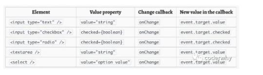

## React中操作DOM的方式————基于ref属性

### 1.React中操作DOM的场景
在React的开发模式中，通常情况下不推荐直接操作原生DOM，但是某些特殊的情况下如果我们需要获取到DOM进行某些操作，比如下面这些场景：
+ 管理焦点
+ 文本选择
+ 媒体播放
+ 触发强制动画

### 2.React中基于ref属性获取DOM的三种方法
#### 方法一：当ref的值为字符串的时候
绑定ref：ref="titleRef"
获取DOM: this.refs.titleRef

基于每一个组件实例对象都有一个属性refs存放着当前的DOM元素对象来获取,这个this.refs对象打印出来如下：
```js
{
	titleRef: h2
	__proto__: Object
}
```

基于操作DOM方法修改DOM中的值
```js
render(){
		return(
			<div>
				<h2 ref="titleRef">{this.state.data}</h2>
				<button onClick={(e)=>this.changeText()}>操作DOM修改文字</button>
			</div>
		)
	}
	
changeText(){
	console.log(this.refs.titleRef)
	this.refs.titleRef.innerHTML = "为人民服务！"
}

```

#### 方法二：当ref的值为对象的时候【官方推荐的方式】
基于React类上的一个方法createRef在构造器中创建一个ref对象
绑定ref：在constructor中通过createRef创建一个ref对象
获取DOM：通过this.titleRef.current

```js
import {createRef} from "react";
constructor(){
		this.titleRef = createRef();
	}
	render(){
		return(
			<div>
				<h2 ref={this.titleRef}>{this.state.data}</h2>
				<button onClick={(e)=>this.changeText()}>操作DOM修改文字</button>
			</div>
		)
	}
	
	changeText(){
		console.log(this.titleRef.current);
		this.titleRef.current.innerHTML = "为人民服务！"
	}

```

#### 方法三：当ref的值为函数的时候
绑定ref：
先在构造器中创建一个this.titleEl = null
然后通过函数ref={args=>this.titleEl=args}来绑定，这里等于将当前DOM的元素对象赋值给了this.titleEl属性。
获取DOM：通过this.titleEl来获取
```js
constructor(){
	this.titleEl = null;
}
render(){
	return(
		<div>
			<h2 ref={(args)=>{this.titleEl=args}}>{this.state.data}</h2>
			<button onClick={(e)=>this.changeText()}>操作DOM修改文字</button>
		</div>
	)
}

changeText(){
	console.log(this.titleEl);
	this.titleEl.innerHTML = "为人民服务！"
}
```


### 3.ref的值会根据节点类型而有所不同

+ 当ref属性作用于HTML元素的时候，构造函数中通过createRef()创建出来的ref对象中的current属性的值是DOM元素对象，也就是HTMLElement元素对象

+ 当ref属性作用于自定义的class类组件的时候，ref对象中的current属性的值是当前类组件实例对象，基于这个用法我们可以在父组件中给子组件加一个ref属性，然后直接在父组件中调用子组件上的属性和方法，从而改变子组件中的数据。

```js
constructor(){
	super();
	this.headerRef=createRef();
}
render(){
	return(
		<div>
			<Header ref={this.headerRef}></Header>
			<button onClick={(e)=>this.changeText()}>操作DOM修改文字</button>
		</div>
	)
}

changeText(){
	console.log(this.headerRef.current); // 获取子组件Header实例对象
	this.headerRef.current.changeNum() // 直接调用Header上的方法修改子组件中数据
}

```

+ 不能在函数组件上使用ref属性，因为函数中没有实例对象，但是可以通过React.forwordRef高阶组件或者hooks中来使用ref，然后就可以在函数式组件中获取DOM元素对象。

## React中的受控组件

### 1. 受控组件的特点
React中的受控组件和非受控组件一般都和HTML表单元素有关。

HTML表单元素如input、select等，它内部的状态(输入框中的值)一般都是由表单元素自己管理的，并根据用户的输入自动的将值更新。

而React中推荐将组件的可变状态保存在组件的state属性中，然后通过调用setState()来更新数据，然后将更新后的数据渲染到视图。

将HTML元素和state结合起来创造一个受控组件：
1. 必须要让React的state成为唯一数据源
2. 渲染表单的React组件控制用户输入过程中发生的操作
3. 单向数据流

被React控制取值的表单输入元素叫做受控组件

### 2. 受控组件的生成
核心思想：让使用表单的组件的state成为该组件中所有表单元素的唯一数据源，而成为唯一数据源的具体做法就是onChange事件和动态绑定表单的value值。

+ 每一个表单元素都有一个在state中对应的属性去记录该表单输入元素的值
通过监听表单元素的onChange事件，通过e.target.value获取到表单输入元素的值
将这个表单输入元素的值通过setState方法赋值给state中的属性
通过动态绑定表单输入元素value属性的值，将表单视图中显示的值和state中属性联系起来
setState方法调用，state中值改变，表单输入元素视图改变，此表单元素的唯一数据源来自于state中，遵循React中单向数据流。

```js
class App extends PureComponent{
	
	constructor(){
		super();
		this.state = {
			username:"", //用户名表单在state中对应的值
			password:""  // 密码表单在state中对应的值
		}
	}
	render(){
		return(
			<div>
				<form onSubmit={(e)=>{this.handleSubmit(e)}}>
					<div>
						<label htmlFor="username">姓名</label>
						<input 
							type="text"
							id="username"  
							name="username"
							onChange={(e)=>{this.handleChange(e)}}
							value={this.state.username}
						/>
					</div>
					
					<div>
						<label htmlFor="password">密码</label>
						<input 
							type="text"
							id="password"  
							name="password"
							onChange={(e)=>{this.handleChange(e)}}
							value={this.state.password}
						/>
					</div>
					
					<button type="submit">点击提交</button>
				</form>
			</div>
		)
	}
	// 表单提交事件
	handleSubmit(e){
		// 阻止默认事件
		e.preventDefault(); 
		// 提交时从state中获取值而不是从e.target中获取值
		const {username,password} = this.state; 
		console.log(username,password);
	}
	
	// 监听表单输入
	handleChange(e){
		console.log(e.target.value); // 获取表单输入元素的值
		console.log(e.target.name); // 用于多表单动态设置属性
		this.setState({
			[e.target.name]:e.target.value,
		})
	}
}
```

### 3. 受控组件的类型
input type=text  value属性 字符串  onChange触发
input type=checkbox  checked属性 布尔值  onChange触发
input type=radio  checked属性 布尔值  onChange触发
textarea value属性 字符串 onChange触发
select  value=option value onChange触发


### 4.受控组件select的使用
onChange事件是加在select元素上使用的
默认选中项不是在options上加selected属性，而是在select元素上绑定value的值是this.state中的值，因为state是表单的唯一数据源。

```js
class App extends PureComponent{
	
	constructor(){
		super();
		this.state = {
			animal:"dog" // 设置默认值
		}
	}
	render(){
		return(
			<div>
				<form onSubmit={(e)=>{this.handleSubmit(e)}}>
					<select name="animal"
							value={this.state.animal}  // 绑定默认值
							onChange={(e)=>this.handleChange(e)}>
						<option name="cat" value="cat">猫咪</option>
						<option name="dog" value="dog">小狗</option>
						<option name="pig" value="pig">小猪</option>
					</select>
					
					<button type="submit">点击提交</button>
				</form>
			</div>
		)
	}
	}
	// 表单提交事件
	handleSubmit(e){
		// 阻止默认事件
		e.preventDefault(); 
		// 提交时从state中获取值而不是从e.target中获取值
		const {animal} = this.state; 
		console.log(animal);
	}
	
	// 监听表单输入
	handleChange(e){
		console.log(e.target.value); // 获取表单输入元素的值
		this.setState({
			animal:e.target.value,
		})
	}
}

```


## React中的非受控组件
不建议使用非受控组件，React推荐使用受控组件来处理表单数据
input输入框的值不交给state来管理，而是通过操作DOM来实现，也就是通过给表单元素一个ref
基于createRef()方法创建一个ref对象，然后拿到表单的DOM，通过这种方法来获取表单数据。
