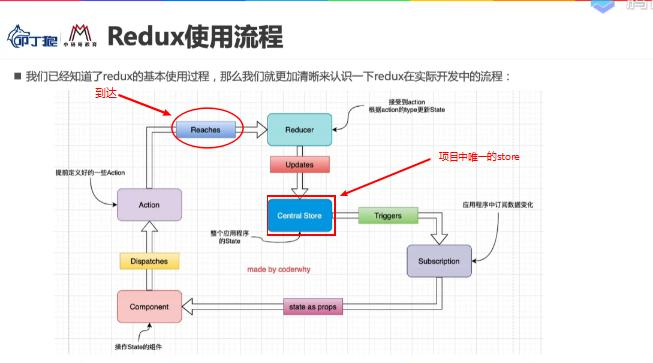

## JavaScript纯函数
在函数式编程中有一个概念就做纯函数，而JS这门语言也符合函数式编程的范式，所以也有纯函数的概念。

### 什么是纯函数？
1. 函数确定的输入一定会产生确定的输出
2. 在程序整个运行的过程中，不能产生副作用。

### 区分一个函数是否为纯函数
函数sum1为纯函数；而函数sum2不是纯函数，因为对于sum2来说依赖了外部的变量foo，一旦在sum2函数调用之后修改了foo的值，那么相同的输入不一定有相同的输出。
```js
function sum1(num1,num2){
	return num1 + num2;
}

let foo = 10;
function sum2(num){
	return foo + num;
}
sum2(66); // 输出66+10 = 76;
foo = 20;
sum2(66); // 输出66+20 = 86;
```

> 如何修改函数sum2为纯函数？
此时sum2变为了纯函数，因为foo基于const声明值不可进行修改，所以相同的输入一定产生相同的输出。
```js
const foo = 10;
function sum2(num){
	return foo + num;
}
```

>如果const定义的是一个引用值，那么此时sum2又不是纯函数了
因为引用值的引用地址不可以修改，但是堆内存中的值是可以进行修改的。
```js
const obj = {
	num:10,
}
function sum2(num){
	return obj.num + num;
}
sum2(66); // 输出66+10 = 76;
foo.num = 20;
sum2(66); // 输出66+20 = 86;
```

> 不能在函数运行过程中产生副作用
大多数副作用都取决于此函数在运行的过程中是否修改了某个传入的引用类型的参数的值，从而导致外部的引用值也发生改变，因为函数在传递参数的时候传递的引用地址。
```js
const obj = {
	name:'lina',
	age:18
}
function getInfo(info){
	info.name = 'tom';
	return info.name + "" + info.age;
}
getInfo(obj); // 输出'tom 18'
console.log(obj) // {name:'tom',age:18} 原对象obj的值经过函数执行已经发生了改变
```

### 纯函数在函数式编程中重要性
+ 编写函数的时候保证了函数的纯度，函数的作用只用于实现自己的业务逻辑，不需要关心传入的参数内容或者依赖其他的外部变量
+ 使用函数的时候，确定的输入在任何地方调用此函数都会产生确定的输出，不必担心因为函数的使用环境不同导致输出不同。

### React中要求组件像纯函数一样保证内部的props不被修改
React中要求无论是函数式组件还是class声明的类组件，这个组件都必须像纯函数一样，保护该组件内部的props不被修改，你可以基于解构赋值等方法使用组件的props对象中的值，但是不要通过点方法或者中括号法去修改props中的值。

> this.props.name = "otherOne" 错误写法 不可写入数据
> if(this.props.name==='demo'){xxx}  正确写法 可以读取数据

## 为什么需要Redux进行状态管理？
> 基于JS状态管理的一些问题
现代通过JavaScript来进行开发的应用程序变得越来越复杂，越来越多的状态需要基于js来进行管理，比如：
+ 客户端发送HTTP请求从服务端返回的数据
+ 浏览器本地Storage缓存的数据
+ 用户在操作界面时产生的数据，比如添加购物车中商品
+ UI页面中某些元素的显示和隐藏的状态
+ 是否加载动画的状态
+ 当前列表分页页码

针对以上这么多的状态state，再加上各个状态之间存在依赖，一个状态的变化会引起另外一个状态的变化，如果只基于js来进行管理的话，那么就会变得异常复杂。

> 状态管理主要管理什么
+ state在什么时候发生了变化？
+ state因为那些操作发生了变化？
+ state发生了怎样的变化？

> React中的状态管理问题

React是一个专门用于构建用户界面的js库，它只是在视图层帮助我们解决了DOM的渲染，比如只需要在render函数中书写JSX代码，就可以转化为ReactElement对象，然后基于ReactDom.render()函数将虚拟DOM渲染为真实的DOM，挂载到html中对应的节点上。

`React的核心是：UI = render(state);`
也就是说React只负责渲染state状态在UI页面呈现，它并不关心state是如何进行管理的。要在react中进行state的状态管理，开发者可以有如下几种方式：
+ 每个组件可以定义自己的state对象
+ 组件之间可以基于props来互相通信传递状态
+ 可以基于Context进行跨组件数据共享
+ 还可以基于eventBus进行全局自定义事件的分发和接收
但是通过以上这些方法管理的状态，第一个是状态的变化不可预测，第二个是不方便bug的调试和问题的追踪。

> Redux简单介绍
单纯的基于js来获取以上这些状态变化的信息非常复杂，所以需要有一个专门进行状态管理的容器来对应用程序中的状态进行管理，而Redux就是这样一个帮助我们进行管理state的容器。

+ Redux是一个javascript的状态容器
+ Redux提供了可预测的状态管理
+ Redux不仅可以和React搭配使用，其实还可以和其他界面库来一起使用，比如Vue和Angular等
+ Redux非常小，包括依赖也只有2KB大小。


## Redux核心理念-store
Store就是进行状态管理的对象，用来制定React进行状态管理的规范

## Redux核心理念-actions

Redux所管理的状态state要发生变化，Redux规定必须基于派发dispatch action来更新数据
每一个action都是一个js对象，主要用于描述这次更新状态的类型type和内容content

type：确定执行那种类型的更新，是新增数据还是删除，是插入还是累加等
content:确定更新状态的内容，这里一般是执行方法时的参数

可以清晰明确的知道所管理的状态发生了何种类型的改变，并且所有数据的变化都是可以追踪和可预测的。

## Redux核心理念-reducer

> 主要作用将action和state联系在一起，每一个定义在reducer中的方法都默认接收一个当前的state作为参数，然后将传入的state和action结合起来生成一个新的state，从而完成state状态的更新。

> 定义在reducer中的每一个方法都必须是一个纯函数，它的作用是首先基于action的type和content处理更新state的操作，然后将更新后的state返回。

> 在进行更新状态的时候，一定不要修改原来的state。因为Redux要求每一个reducer都必须是一个纯函数，那么就意味着在函数的运行期间不可以修改任何对象属性的值，从而造成一定的副作用。
> state的值可以进行读取，但是不能进行写入。如果一定要修改，需要先创建一个当前state的副本，然后基于副本进行修改，最后再将修改完成的副本state赋值给state。

```js
const initialState = {
	list:[
		{name:'wade',age:31},
		{name:'bosh',age:18},
		{name:'rose',age:20},
	]
}

const action1 = {type:'ADD_ONE',content:{name:'newBoy',age:20}}
const action2 = {type:'INC_AGE',index:1}
const action3 = {type:'CHANGE_NAME',content:{newName:"flyBird",index:1}}


function reducer(state = initialState,action){
	switch(action.type){
		case 'ADD_ONE':
			return {...state,list:[...state.list,action.content]}
		case 'INC_AGE':
			const cloneList = [...state.list];
			cloneList.forEach((item,index)=>{
				if(index === action.index){
					item.age+=1;
				}
			})
			return {...state,list:cloneList}
		case 'CHANGE_NAME':
			const cloneList = [...state.list];
			const {index:activeIndex,newName} = action.content;
			cloneList.forEach((item,index)=>{
				if(index===activeIndex){
					item.name = newName;
				}
			})
			return {...state,list:cloneList}
		default:
			return state;
	}
}
```
## Redux的三大原则
1. 单一数据源
一般情况下，应该将一个应用程序中的所有state都存储在一颗状态树中，并且这个状态树只存储在一个store中。
这样做的好处在于单一数据源可以让整个应用程序的state变为方便维护追踪和修改。

2. 保证state状态为只读的
Redux规定唯一可以修改state的方法是触发action，所以不要试图去直接通过点方法或者中括号方法修改state中的状态。
这样就确保了不管是视图层中的事件监听或者网络请求不会直接修改state中状态，state中状态的修改只能基于action来描述。
这样做的好处在于保证所有状态的修改都可以集中化管理，并且按照严格的顺序执行，不需要担心多个地方同时操作同一个数据源的问题(竞态)出现。

3. 使用纯函数来执行更新状态
Redux规定reducer必须是一个纯函数。它主要用于连接要维护的状态state以及描述如何更新状态的action，并最终返回一个新的state，这个返回的state就是当前最新的状态。
必须要保证reducer在操作的过程中，不修改state中的状态数据，不产生任何副作用，必须是一个纯函数。


## Redux的基本使用
### 单独使用redux库进行状态管理(不关联react)
先创建一个测试项目,熟悉redux的使用流程和api。这种学习一个新的第三方库或者新知识，基于npm来管理并且基于node环境来测试的思路可以进行学习，因为node环境可以直接执行js文件，不用创建html文件交由浏览器才可以被执行。
+ 基于npm init -y创建一个项目进行依赖管理
+ 安装redux
+ 创建src目录，并且创建index.js
+ 基于node环境来执行index.js文件
> 在node13.2.0版本之前，node环境不支持ES6 modules模块化规范
  node版本低于13.2.0，需要在当前项目的package.json文件中添加属性"type":"module"。
  并且添加如下选项:"scripts":{
	  "start":"node --experimental-modules src/index.js"
  }
> node版本高于13.2.0，只需要添加type：module属性即可
> 在基于es6的模块化导入文件的时候，需要跟上js文件的后缀名.js
### Redux基本使用流程
1. 创建一个对象用来保存要管理的应用程序状态
```js
const initicalState = {
	counter:0,
}
```

2. 定义reducer
```js
function reducer(state=initicalState,action){
	switch(action.type){
		case 'INCREMENT':
			return {...state,counter:state.counter+1}
		case 'DECREMENT':
			return {...state,counter:state.counter-1}
		case 'ADD_NUM':
			return {...state,counter:state.counter+66}
		case 'SUB_NUM':
			return {...state,counter:state.counter-99}
		default:
			return state;
	}
}
```


```js
const store = redux.createStore(reducer);
```

4. 基于store.subscribe(callback)来订阅store改变
订阅subscribe一定是在dispatch分发的前面
```js
store.subscribe(()=>{
	console.log('counter:',store.getState().counter);
})
```

5. 定义actions
```js
const action1 = {type:"INCREMENT"}
const action2 = {type:"DECREMENT"}
const action3 = {type:"DECREMENT"}
const action4 = {type:"ADD_NUM",num:66}
const action5 = {type:"SUB_NUM",num:99}

```

6. 基于store.dispatch(action)来提交更新state
```js
store.dispatch(action1);
store.dispatch(action2);
store.dispatch(action3);
store.dispatch(action4);
store.dispatch(action5);

```


## Redux的目录结构划分
在项目的src文件夹下创建store文件夹，专门存放有关状态管理相关的代码。基本每个基于redux管理状态的项目都有这四个文件。
### 1. store/index.js 
此文件主要为store文件夹的入口文件，在脚手架搭建的webpack环境下,组件可以直接基于：
import store from '@/store'
这种方式来导入store对象，并在组件中进行操作。

+ 导入redux
+ 导入执行修改的reducer函数
+ 创建store对象并导出，便于其他组件导入
```js
import redux from 'redux';
import reducer from './reducer.js'

/* 创建项目单一数据源store */
const store = redux.createStore(reducer);

export default store;
```

### 2. store/reducer.js
+ 创建一个初始对象defaultState，也就是要维护的状态
+ 定义reducer函数，接收state和action作为参数，并基于switch-case语句来找到action.type要执行的方法，将对应的方法执行后返回一个新的state对象。
```js
/* 导入常量 */
import {
	ADD_NUM,
	SUB_NUM,
	INCREMENT,
	DECREMENT
} from './constant.js'

const defaultState = {
	counter:0,
}

function reducer(state=defaultState,action){
	const {type,num:payload} = action;
	const {counter} = state;
	switch(action.type){
		case INCREMENT:
			return {...state,counter:counter+1}
		case DECREMENT:
			return {...state,counter:counter-1}
		case ADD_NUM:
			return {...state,counter:counter+payload}
		case SUB_NUM:
			return {...state,counter:counter-payload}
		default:
			return state;
	}
}
export default reducer;

```

### 3. store/actionCreators.js
+ 定义用于派发的action，以函数表达式+箭头函数的方法进行定义，让action具有可复用性
+ 注意小括号必须写，否则会将原本返回的actions对象当做函数体来执行导致报错
```js
/* 导入常量 */
import {
	ADD_NUM,
	SUB_NUM,
	INCREMENT,
	DECREMENT
} from './constant.js'

// 小括号必须写，否则会将原本返回的actions对象当做函数体来执行导致报错
export const addNum = num => ({
	type: ADD_NUM,
	num,
})

export const subNum = num => ({
	type: SUB_NUM,
	num,
})

export const increment = () => ({
	type: INCREMENT
})

export const decrement = () => ({
	type: DECREMENT
})

```

### 4. store/constant.js
+ 为了防止reducer中的type以及action中的type书写出错对应不起来，将这些方法名用常量进行代替，避免在多个地方使用的时候书写错误。
+ 方便统一修改和替换。
```js
export const ADD_NUM = "ADD_NUM";
export const SUB_NUM = "SUB_NUM";
export const INCREMENT = "INCREMENT";
export const DECREMENT = "DECREMENT";
```

### 5. 定义好以上代码之后，在业务组件中使用
+ 基于订阅消息来获取store中状态的更新
+ 基于store.getState()来获取最新的值并进行更新
+ 基于dispatch分发不同的action来更新组件状态
```js
/* 导入store对象 */
import store from './store/index.js';

/* 导入当前组件需要派发的action */
import {addNum,subNum,increment,decrement} from './store/actionCreators.js';

// 订阅store的修改
store.subscribe(()=>{
	console.log('+++++++++counter:',store.getState().counter);
})
/* 在某个场景(按钮点击、上拉加载、...)触发的时候 派发action即可 */

store.dispatch(addNum(88));
store.dispatch(subNum(66));
store.dispatch(increment());
store.dispatch(decrement());
store.dispatch(increment());

```

## Redux在React中的应用
### React组件中使用redux的一个基本流程和思路


> 应该在组件的componentDidMount生命周期函数中对store管理的状态进行订阅，一旦store中的状态发生变化，那么应该调用setState方法一次，以便于将store中的更新同步到当前组件的UI上来。

> 一旦当前组件有了订阅，那么就需要在组件的componentWillUnmount生命周期函数中取消该订阅。store.subscribe方法执行的返回值是一个函数unsubscribue，在取消订阅的时候将其执行即可。
```js
constructor(props) {
	super(props);
	this.state = {
		counter:store.getState().counter,
	}
}
componentDidMount(){
	 this.unsubscribue = store.subscribe(()=>{
		this.setState({
			counter:store.getState().counter,
		})
	})
}

componentWillUnmount(){
	this.unsubscribue();
}
```
+ 组件中某个按钮点击触发更新状态的条件
+ 组件dispatch一个更新的action
+ 更新状态的action到达reducer
+ reducer基于type进行判断，然后完成state状态更新
+ store中状态变化，组件中接收到订阅消息
+ 组件执行setState方法，自身state被更新
+ 组件所挂载的View界面发生改变

### 在导入redux时的一些注意事项

> 在基于脚手架搭建的项目中导入redux的时候要注意有两种方式：
因为redux这个库不是默认导出的，而是export {xxx,yyy,...}这种导出了一个对象
+ 方法一:采用 *as的方法导入 
代表将export的这个对象中的所有属性都导入，并在当前模块中用as后面的那个标识符进行接收
后续就可以使用对象的点方法进行访问
```js
import * as redux from 'redux';
const store = redux.createStore(reducer);

```

+ 方法二:采用对象{}解构的方式导入
代表只将export对象中名称相同的属性导入，是一种比较简单的导入方式
然后直接进行使用即可。
```js
import {createStore} from 'redux';
const store = createStore(reducer);
```


