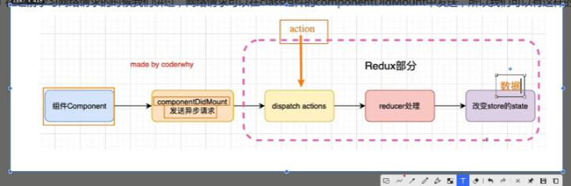

## 知识梳理总结
### 只引入一个redux库的时候
1. index.js 从redux中引入createStore函数，并创建一个store并默认导出 const store = createStore(reducer);
2. reducer.js 中默认导出一个reducer函数，纯函数，返回一个纯对象state，主要是用来处理state数据如何变化的,一般来说initialState对象也是定义在这个文件中的
3. actionCreator.js 中导出一个个以函数定义的action const addAction = ()=>({type:"add",num})
4. constant.js 中主要是存放一些action的type的常量

以上都是store文件夹的文件，在业务组件中使用的时候：
1. 导入store对象
2. 在构造器中定义this.state = {storeState:store.getState()} 通过这种方法将组件的状态和store管理的公共状态联系起来
3. 在生命周期componentDidMount中订阅store中state的变化并更新组件的state，并且返回一个取消订阅的函数
this.unsubscribue = store.subscribe(()=>{this.setState({storeState:store.getState()})})
4. 在什么周期componentWillUnmount的时候取消订阅 this.unsubscribue();
5. 在组件中某个UI动作触发了事件，首先通过store.dispatch(action)将要执行的修改store中state的动作分发到reducer中，reducer修改state，组件监听到订阅，重新更新组件的state，页面数据发生变化，这是一个很清晰的单向数据流.

### 只引入一个redux库的弊端————手写一个connect来解决

代码重复，耦合度高，需要封装一个connect函数将组件和store连接起来，将重复的动作交给函数去执行就是了。

### 解决的不够优雅————写的connect需要依赖当前项目中的store

基于context创建的共享组件StoreContext解决
注意在将一个组件的contextType设置为StoreContext的时候，这个组件的构造器除了props之外还可以接受一个context参数，并且在组件的其他地方可以基于this.context来获取到共享的value属性的值，也就是this.context = store

### 不用手写了 直接用react-redux库提供的Provider组件帮助我们实现

唯一不同的是将之前的StoreContext.Provider变为Provider;将value变为store即可
这时候就不用自己手写的connect和context了，而是全部都用这个库的
在业务组件中将原本手写的connect修改为从react-redux中导入即可 

### 现在同步的解决了，异步的如何解决呢？

组件的生命周期函数中发起异步网络请求
组件获取网络请求数据
封装action，将请求的数据封装起来
dispatch 一个保存请求数据的action
到达reducer
reducer处理，将其数据保存到state中
其他组件中就可以直接使用了

### 异步虽说解决了，但是不够优雅 需要借助thunk中间件将异步请求交给redux去做
安装redux-thunk这个专门处理异步的中间件
导入中间件
调用redux提供的applyMiddleware方法应用中间件
const store = createStore(reducer,enhancerStore);
在生命周期中直接this.props。调用一个方法
这个方法的作用就是dispatch一个action，这个action就是核心，是一个函数，我们只需要dispatch这个函数的引用，传递参数以及执行这个函数是thunk中间件的事情。
这个action是一个函数，接受两个参数，在这个函数中进行网络请求，请求后二次dispatch给reducer
刷新state
组件的UI页面刷新


### redux库在react中直接使用的问题
首先要明确一个概念，那就是redux这个库并不是一定要依赖react才可以进行状态管理，它可以结合angular，可以结合vue库进行javascript应用程序中状态的管理。

假设redux相关的actionCreators,constant,reducers这些准备工作都做好的前提下，我们在react项目中使用redux来进行项目管理的时候，总是要进行以下几个操作：

1. redux.createStore()方法创建的store必须要导入当前组件
2. 当前组件中要派发的以函数形式定义的action必须要导入当前组件，用来描述执行更新状态的类型和内容
3. 组件的state中要基于store.getState().xxx方法获取到当前组件要展示的状态值
4. 组件的componentDidMount中总是要基于store.subscribe()方法进行store中state更新的订阅，当state发生更新的时候要执行setState函数来更新当前组件的UI。
5. 组件的componentWillUnMount中总是要基于订阅时的返回的返回来取消订阅。

> 如下所示，在Home组件中写的代码，在About中很多地方要重写一遍
```js 基于redux库进行状态管理的Home组件
import React, {
	PureComponent
} from 'react';
/* 导入store */
import store from '../store/index.js';
/* 导入当前组件所需的action */
import {
	addNum,
	subNum
} from '../store/actionCreators.js';

class Home extends PureComponent {
	constructor(props) {
		super(props);
		this.state = {
			counter: store.getState().counter,
		}
	}
	componentDidMount() {
		this.unsubscribue = store.subscribe(() => {
			this.setState({
				counter: store.getState().counter,
			})
		})
	}
	componentWillUnmount() {
		this.unsubscribue();
	}

	addNum(num) {
		store.dispatch(addNum(num));
	}
	subNum(num) {
		store.dispatch(subNum(num));
	}

	render() {
		const {counter} = this.state;
		return (
		 <div style={{margin:"100px"}}>
		 	<h1>当前计数:{counter}</h1>
		 	<button onClick={()=>{this.addNum(5)}}>+5</button>
		 	<button onClick={()=>{this.subNum(100)}}>-100</button>
		 </div>
		)
	}
}
export default Home;
```

```js 基于redux库进行状态管理的About组件
import React, {PureComponent} from 'react';
/* 导入store */
import store from '../store/index.js';
/* 导入当前组件所需的action */
import {
	increment,
	decrement
} from '../store/actionCreators.js';

class About extends PureComponent{
	constructor(props) {
	    super(props);
		this.state = {
			counter:store.getState().counter,
		}
	}
	componentDidMount(){
		 this.unsubscribue = store.subscribe(()=>{
			this.setState({
				counter:store.getState().counter,
			})
		})
	}
	componentWillUnmount(){
		this.unsubscribue();
	}
	
	addClick(){
		store.dispatch(increment());
	}
	subClick(){
		store.dispatch(decrement());
	}
	
	render(){
		const {counter} = this.state;
		return(
			<div style={{margin:"100px"}}>
				<h1>当前计数:{counter}</h1>
				<button onClick={()=>{this.addClick()}}>+1</button>
				<button onClick={()=>{this.subClick()}}>-1</button>
			</div>
			
		)
	}
}
export default About;
```

### connect函数的手写封装过程
以上这些步骤，在每一个想要使用redux创建的容器来管理state的组件中都要写一遍，毫无疑问这种代码非常冗余而且耦合度太高，所以我们需要想一个办法，把每个组件中都要写的这些相同的代码抽取到一个函数中，然后将这个函数执行就可以了，这个封装的函数必须具有以下几个功能和特点：

1. 组件中相同的代码抽取到函数体中，比如生命周期中订阅和取消订阅的操作
2. 组件中不同的地方体现在每个组件依赖的状态state以及触发操作之后派发的action不同，那么应该将这部分不同的内容通过函数形参接收。
3. 这个函数的功能是将redux管理的状态和业务组件以一种更加低耦合的方式链接到一起，没有这个函数也可以基于redux进行状态管理，但是代码的耦合度太高了。
4. 在封装此函数的时候要涉及到高阶组件的应用。

> 封装connect函数的实现
1. connect函数接收两个参数，每个参数都是一个函数，一般这两个参数分别用mapStateToProps和mapDispatchToProps来声明形参。但是要知道：
	+ mapStateToProps是一个函数，参数就是当前store中管理的state对象，返回值也是一个对象，基于这个函数可以将store中的状态中的值取出来拿给组件进行属性增强，然后在组件中就可以基于this.props.xxx进行获取值。
	+ mapDispatchToProps也是一个函数，参数是store.dispatch这个函数引用，返回值是一个对象，基于这个函数可以获取到store.dispatch方法可以派发action的能力，在传入connect之后进行属性增强，然后在组件中就可以基于this.props.xxx进行分发action。
2. connect函数的返回值是一个高阶组件，也就是一个高阶函数。
   + 这个高阶组件的参数是一个组件，也就是要和redux中状态进行链接的组件
   + 这个高阶组件的返回值也是一个组件，这个组件一般是一个类组件，并且是一个匿名的类组件。这个要返回的类组件就是将原组件经过高阶组件的处理，经过属性props增强之后的新组件newCpn。
   + newCpn组件的state和参数mapStateToProps(store.getState())联系起来
   + newCpn组件的componentDidMount和componentWillUnmount是公共代码
   + newCpn组件中在render这个WrappedComponent组件的时候，其实就是在给传入的组件进行属性增强。
```js
import store from './store/index.js'
import React,{PureComponent} from 'react'

function connect(mapStateToProps,mapDispatchToProps){
	return function inhanceHOC(WrappedComponent){
		return class extend PureComponent{
			constructor(props){
				super(props);
				this.state = {
					storeState:mapStateToProps(store.getState())
				}
			}
			/* 建立订阅 */
			componentDidMount(){
				this.unSubscribe = store.subscribe(()=>{
					this.setState({
						storeState:mapStateToProps(store.getState())
					})
				})
			}
			/* 取消订阅 */
			componentWillUnmount() {
				this.unsubscribue();
			}
			/* 渲染高阶组件 */
			render(){
				return (
					<WrappedComponent
					  {...this.props}
					  {...mapStateToProps(store.getState())}
					  {...mapDispatchToProps(store.dispatch)}
					/>
				)
			}
		}
	}
}

```


### 手写connect函数在组件中使用：连接组件和store
```js
import store from '../store/index.js';
import connect from '../utils/connect';
import {
	addNum,
	subNum
} from '../store/actionCreators.js';

class Home extends PureComponent {
	render() {
		const {counter} = this.props;
		return ( 
			<div style = {{margin: "100px"}} >
				<h1> 当前计数: {counter} </h1> 
				<button onClick = {() => {this.props.addNum(5)}}>+5</button> 
				<button onClick = {() => {this.props.subNum(100)}}>-100</button> 
			</div>
		)
	}
}

/* 拿到store.state状态管理对象，拥有了状态就可以获取到任何一个想要展示的值 */
const mapStateToProps = state=>{
	return {
		counter:state.counter,
	}
}
/* 拿到store.dispatch函数的引用，拥有了dispatch函数就拥有了分发action给reducer执行的能力 */
const mapDispatchToProps = dispatch=>{
	return {
		addNum:(num)=>{
			dispatch(addNum(num))
		},
		subNum:(num)=>{
			dispatch(subNum(num))
		}
	}
}

export default connect(mapStateToProps,mapDispatchToProps)(Home);

```

### 将connect函数封装成为一个库（react-redux的雏形）
问题：connect函数封装的还是不够独立，因为connect函数中还是依赖了业务逻辑中的store
希望：connect对store没有任何依赖，完全独立于业务逻辑
方案：依然需要拿到store，但是不通过导入的方式拿到store，而是通过context来实现共享store

>>> 如果将这个utils文件夹想象为一个库的话，我们在任意一个项目中只需要安装这个库，然后在自己项目的index.js中导入这个库提供的Context共享对象，然后基于Provider的value属性将自己项目要管理的store状态共享出去，最后再自己项目的业务组件中导这个库提供的connect函数，基于this.props就可以将组件和store连接起来了。

#### 第一步：创建共享对象StoreContext
1. 在connect.js同目录文件下新建context.js,用于创建共享的context对象，此时可以将封装了connect函数和context对象的文件夹当做一个很小的库，完全独立于业务逻辑代码的库。
2. 基于React.createContext方法创建一个共享store的组件对象然后导出
```js
import React from 'react';
export const StoreContext = React.createContext();
console.log('创建出来的共享组件StoreContext',StoreContext);

> 打印共享组件对象StoreContext如下：可见拥有Provider和Consumer两个属性，这两个属性所对应的也是React组件对象.
{
	$$typeof: Symbol(react.context)
	Consumer: {$$typeof: Symbol(react.context), _context: {…}, _calculateChangedBits: null, …}
	Provider: {$$typeof: Symbol(react.provider), _context: {…}}
	_calculateChangedBits: null
	_currentRenderer: {}
	_currentRenderer2: null
	_currentValue: undefined
	_currentValue2: undefined
	_threadCount: 0

}
```

#### 第二步：在index.js中将store共享出去
3. 在项目的index.js入口文件处将当前项目中要管理的store引入;
4. 同样在index.js中将StoreContext共享对象导入
5. 基于StoreContext.Provider组件的value={store}将store对象共享出去
6. 其他业务组件便建立起了和store的联系
```js
import App from "./reduxDemo/index.js"
import {StoreContext} from './utils/context.js';
import store from './store/index.js';


ReactDOM.render(
	<StoreContext.Provider value={store}>
		<App></App>
	</StoreContext.Provider>,
	document.getElementById('root')
)
```

#### 第三步：将connect中的store解耦，基于共享的context进行替换
7. 在connect.js中导入该组件对象并将原来的store进行替换，让connect函数和业余代码中的store完全解耦
8. 需要将原本返回的匿名class类组件添加一个名字比如EnhanceComponent，方便添加EnhanceComponent.contextType = context。这一步之后再将EnhanceComponent返回return出去。并且这样做有两个好处：
	+ 当前组件EnhanceComponent中可以基于this.context访问共享的信息
	+ 当前组件的constructor中除了props会多一个context参数，方便在构造器中直接通过context拿到共享的信息，因为在constructor函数执行的时候，还不能通过this.context拿到值。
```js
/* 不再需要导入当前业务的store */
import {StoreContext} from './context.js';

export default function connect(mapStateToProps,mapDispatchToProps){
	return function enhanceHOC(WrappedComponent){
		class EnhanceComponent extends PureComponent {
			constructor(props,context) {
			    super(props);
				this.state = {
					storeState:mapStateToProps(context.getState())
				}
			}
			
			componentDidMount() {
				this.unsubscribue = this.context.subscribe(() => {
					this.setState({
						storeState:mapStateToProps(this.context.getState())
					})
				})
			}
			
			componentWillUnmount() {
				this.unsubscribue();
			}
			
			render(){
				return(
					<WrappedComponent 
						{...this.props}
						{...mapStateToProps(this.context.getState())}
						{...mapDispatchToProps(this.context.dispatch)}
					/>
				)
			}
		}
		EnhanceComponent.contextType = StoreContext;
		return EnhanceComponent;
	}
}
```

### 基于真实的react-redux库进行状态管理
```js
// import {StoreContext} from './utils/context.js';。 这是自己创建的
import {Provider} from 'react-redux';  // 这是从react-redux中导入的Provider共享函数组件

import store from './store/index.js';
ReactDOM.render(
	/*
	这是自己创建的共享对象进行传值
	<StoreContext.Provider value={store}>
		<App></App>
	</StoreContext.Provider>,
	*/
	
	/* Provider共享函数组件 唯一不同的是基于store属性传值 */
	<Provider store={store}>
		<App></App>
	</Provider>,
	document.getElementById('root')
)

> 在业务组件中只需要将原来从utils导入的改为从react-redux中导入即可
// import connect from '../utils/connect';
import {connect} from 'react-redux'
```
### react-redux的源码解析
react-redux默认导出的对象打印如下所示,可以看到两个重要的api:Provider和connect
```js
{
	Provider: ƒ Provider(_ref)
	ReactReduxContext: Object
	batch: ƒ batchedUpdates$1(fn, a)
	connect: ƒ connect(mapStateToProps, mapDispatchToProps, mergeProps, _ref2)
	connectAdvanced: ƒ connectAdvanced()
	createDispatchHook: ƒ createDispatchHook(context)
	createSelectorHook: ƒ createSelectorHook(context)
	createStoreHook: ƒ createStoreHook(context)
	shallowEqual: ƒ shallowEqual(objA, objB)
	useDispatch: ƒ useDispatch()
	useSelector: ƒ useSelector(selector, equalityFn)
	useStore: ƒ useStore()
}
```

#### 1. Provider是一个函数式组件,以store作为参数传递共享的store
> { store, context, children }是对arguments做了一个解构
> const { store, context, children } = arguments;

```js
function Provider({ store, context, children }) {
	... 省略的代码
  /* ReactReduxContext其实就是调用React.createContext()创造出来的组件 */
  const Context = context || ReactReduxContext
  /* 这一步好比<StoreContext value={store}><App><App/><StoreContext/>*/
  return <Context.Provider value={contextValue}>{children}</Context.Provider>
}
```

#### 2. connect函数是createConnect函数执行的结果
> createConnect函数中接收对象参数及默认值的写法
{
  connectHOC = connectAdvanced,
  mapStateToPropsFactories = defaultMapStateToPropsFactories,
  mapDispatchToPropsFactories = defaultMapDispatchToPropsFactories,
  mergePropsFactories = defaultMergePropsFactories,
  selectorFactory = defaultSelectorFactory
} = {}
这种写法的意思是：这个函数createConnect接收一个对象obj作为参数
如果在调用createConnect()的时候不传递参数，那么就等于在对undefiend做对象的解构，此时是肯定会报错的；但是如果不传递的时候给一个默认值空对象{}，那么在语法上就不会报错了，作者在这里就是为了避免不传递参数导致错误，所以做了一个对象的解构。在解构之后紧接着对每一个参数又做了一个默认值的赋值。

> createConnect函数的返回值是connect函数，connect函数接收mapStateToProps和mapDispatchToProps参数，最终将函数connectHOC()执行的结果返回，而函数connectHOC()执行的结果就是一个高阶组件，然后进行属性增强，所以总体的思路是和自己写的差不多的。
```js
export default /*#__PURE__*/ createConnect()
返回值是一个函数connect
connect函数中传入mapStateToProps和mapDispatchToProps
返回一个connectHOC函数的执行结果

export function createConnect({
  connectHOC = connectAdvanced,
  mapStateToPropsFactories = defaultMapStateToPropsFactories,
  mapDispatchToPropsFactories = defaultMapDispatchToPropsFactories,
  mergePropsFactories = defaultMergePropsFactories,
  selectorFactory = defaultSelectorFactory
} = {}) {
  return function connect(
    mapStateToProps,
    mapDispatchToProps,
  ) {
    return connectHOC(selectorFactory, {})
  }
}

```


### 将异步操作在组件中进行的状态管理流程

将Home组件中异步网络请求的数据保存至state中，并在About组件中拿到state中的数据并进行展示，这样就从服务器异步获取的数据保存在了state中，并可以在全局任意一个组件中拿到数据进行使用。
1. 提前定义好state中要保存的状态的数据类型以及reducer中要执行的操作
```js
const defaultState = {
	bannerList:[],
	recommendList:[]
}

function reducer(state=defaultState,action){
	switch(action.type){
		case CHANGE_BANNER:
			return {...state,bannerList:action.bannerList}
		case CHANGE_RECOMMEND:
			return {...state,recommendList:action.recommendList}
		default:
			return state;
	}
}
```
2. 提前定义好在组件中派发的action
```js
export const changeBannerAction = (bannerList)=>({
	type:CHANGE_BANNER,
	bannerList
})

export const changeRecommendAction = (recommendList)=>({
	type:CHANGE_RECOMMEND,
	recommendList
})
```

3. 在Home组件中的mapDispatchToProps中导入store中的dispatch，具有分发action的能力
```js
const mapDispatchToProps = dispatch=>{
	return {
		changeBanner:(bannerData)=>{
			dispatch(changeBannerAction(bannerData))
			// dispatch({type:CHANGE_BANNER,bannerList:bannerData})
		},
		changeRecommend:(recommendData)=>{
			dispatch(changeRecommendAction(recommendData))
			// dispatch({type:CHANGE_RECOMMEND,recommendList:recommendData})
		}
	}
}
```
4. Home组件获取数据后基于this.props将获取的数据dispatch到store中
```js
async componentDidMount(){
	const res = await axios({
		url:'http://123.207.32.32:8000/home/multidata',
		method:'get'
	});
	const {banner,recommend} = res.data.data;
	this.props.changeBanner(banner.list);
	this.props.changeRecommend(recommend.list);
}
```
5. About组件中基于this.props从store中将保存的数据拉取到组件中的props中
```js
const mapStateToProps = state=>{
	return {
		bannerList:state.bannerList,
		recommendList:state.recommendList
	}
}

```
6. About组件渲染数据
```js
render(){
	return(
		<div style={{margin:"100px"}}>
			{
				this.props.bannerList.map((item,index)=>{
					return(
						<div key={item.acm}>{item.title}</div>
					)
				})
			}
		</div>
	)
}
```

### 将异步操作在redux的中间件（redux-thunk）中进行的状态管理流程

> 之前方案的缺点
必须要将网络异步请求放到组件的生命周期函数中执行，但是既然网路请求所得的数据也数据状态，那么就应该交给redux来进行管理，应该将组件和状态相分离。

> 实现的难点
在redux中并没有一个地方可以直接发起异步请求并保存数据值state中，所以这里得引入中间件的概念

> 中间件的概念
中间件就是在dispatch的action和最终到达的reducers中间，拓展一些自己的代码和操作，比如可以是异步网络请求，可以是日志记录等等。

> redux官方推荐的进行网络请求的中间件是redux-thunk

> redux-thunk实现异步请求的原理
原本情况下默认的dispatch(action)的action是一个js对象,而经过dispatch之后会直接交给reducers处理。

但是将redux-thunk注入到redux之后，redux-thunk可以让dispatch的action不是一个对象而是一个函数，在这个函数中把要做的事情做了，比如发起网络请求并拿到结果，然后再拿到结果之后再次调用dispatch，这次dispatch的action就是一个js对象了。

当dispatch的action是一个函数的时候，这个函数一般被注册在actionCreator.js中,并且这个函数会被自动调用而不需要我们手动调用。
```js
/**
 * @params dispatch {Funtion} store对象上的dispatch函数 用于再次派发action
 * @params getState {Funtion} store对象上的getState函数 可获取state的值
 */
getIndexDataAction = (dispatch,getState)=>{
	axios({
		url:'http://123.207.32.32:8000/home/multidata',
		method:'get'
	}).then(res=>{
		const {banner,recommend} = res.data.data;
		// dispatch二次分发，直接提交给reducer处理
		dispatch(changeBannerAction(banner.list)); 
		dispatch(changeRecommendAction(recommend.list));
	}).catch(err=>{
		throw new Error(err.message);
	});
	
}
```

> 基于中间件发起请求并保存数据的操作流程

1. 在store的index.js中将中间件导入并注入到store中
redux库中导出了一个方法applyMiddleware专门用来注册中间件，返回一个StoreEnhancer
恰好redux.createStore方法的第二个参数就是StoreEnhancer

```js
import * as redux from 'redux';
import reducer from './reducer.js'
/* 导入中间件thunkMiddleware */
import thunkMiddleware from 'redux-thunk'

/* 将导入的中间件注入 */
const StoreEnhancer = redux.applyMiddleware(thunkMiddleware);

/* 创建项目单一数据源store */
const store = redux.createStore(reducer,StoreEnhancer);

export default store;
```
2. 在Home组件中只进行dispatch调用

```js
import {getIndexDataAction} from '../store/actionCreators.js';

class Home extends PureComponent {
	componentDidMount(){
		this.props.getIndexData();
	}
	render() {
		return ( 
			<div style = {{margin: "100px"}}></div>
		)
	}
}
const mapDispatchToProps = dispatch=>{
	return {
		getIndexData:()=>{
			dispatch(getIndexDataAction)
		}
	}
}
export default connect(()=>({}),mapDispatchToProps)(Home);
```
3. 在store的actionCreateor中进行中间件使用，发起网络请求
```js
/* 导入常量 */
import {
	CHANGE_BANNER,
	CHANGE_RECOMMEND
} from './constant.js'
import axios from 'axios'

// 小括号必须写，否则会将原本返回的actions对象当做函数体来执行导致报错
export const changeBannerAction = (bannerList)=>({
	type:CHANGE_BANNER,
	bannerList
})

export const changeRecommendAction = (recommendList)=>({
	type:CHANGE_RECOMMEND,
	recommendList
})

/* thunkMiddleware中的action函数 */
export const getIndexDataAction = (dispatch,getState)=>{
	axios({
		url:'http://123.207.32.32:8000/home/multidata',
		method:'get'
	}).then(res=>{
		const {banner,recommend} = res.data.data;
		dispatch(changeBannerAction(banner.list));
		dispatch(changeRecommendAction(recommend.list));
	}).catch(err=>{
		throw new Error(err.message);
	});
}
```

4. 将About组件中展示保存的数据
```js
class About extends PureComponent{
	render(){
		return(
			<div style={{margin:"100px"}}>
				<div>
					{
						this.props.bannerList.map((item,index)=>{
							return(
								<div key={item.acm}>{item.title}</div>
							)
						})
					}
				</div>
			</div>
		)
	}
}

const mapStateToProps = state=>{
	return {
		counter:state.counter,
		bannerList:state.bannerList,
		recommendList:state.recommendList
	}
}

export default connect(mapStateToProps)(About);
```

